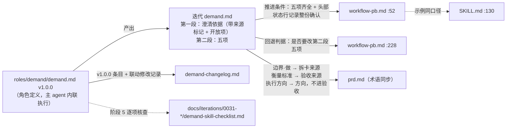

# architecture.md — 0031-demand-convergence-redesign

**版本**: 0.1.0
**状态**: 审核中（兼作 `docs/skill-design-protocol.md` §11.4 的 OPTIMIZATION_PROPOSAL，经方案确认门由用户审核）
**迭代**: 0031-demand-convergence-redesign
**创建日期**: 2026-09-28
**阶段**: 技术架构（阶段 3）
**输入**: `prd.md` v1.1.0 + `prd/` 15 张卡（A-01~A-07 待填）；现状文件 `roles/demand/demand.md` v0.7.0、`roles/demand/data/demand-changelog.md`、`roles/workflow-pb/workflow-pb.md` v0.14.1（:52 / :228 / :241）、`.claude/skills/workflow-pb/SKILL.md` v1.15.2（:130）、`roles/prd/prd.md` v0.1.0；规范 `docs/skill-design-protocol.md`（§2 / §4.4 / §4.6 / §9.1.1 / §11.4 / §12，只读）、`principles/meta/agent-design-protocol.md`（七层 / 原则内联 / 流程层，只读）

本迭代的"架构" = 新版 `roles/demand/demand.md` 的章节结构、各规则落位与措辞口径、来源标记词表、以及 demand ↔ workflow-pb ↔ prd ↔ SKILL.md 的跨文件对接契约。不涉及代码、不引入任何新文件类型（唯一新增文件是阶段 5 产出的 §12 核查记录，见 §9）。

---

## 1. 优化背景

### 1.1 现状基线（v0.7.0，已逐行读过）

| 结构块 | v0.7.0 现状 | 问题（对应事实） |
|---|---|---|
| 首部 CRITICAL ×3 | model_inferred 必经确认 / 两段不能为空 / 不用开放问题替代提案 | 只有"问不问"，没有"归谁"（F-2）；第三条把提案负担全压在"逐条请用户确认"上 |
| Strategy | 八行惯性表 + 问题结构判断（决策形状 / 决策关键度）+ 六维诊断（含第 6 维方案雏形） | 第 6 维与"参考视角"把技术决策推给用户（F-3）；可验证性只查措辞（F-5） |
| Workflow·Align | 草稿 v0（旧五问）→ 角色反射（专家视角 + 维度列表，显式展示）→ 维度粒度自检 | 维度平铺、按缺口大小排，无依赖顺序（F-1） |
| Workflow·Plan | 每维度一段调研摘要（现状/缺口/优先级） | 同上，依附维度列表 |
| Workflow·Work | 同维度深挖 + 追问反射（显式展示）+ 关键决策深挖下限 + 四段式 + 参考视角子流程 + 维度收敛状态标记 + 澄清写入规则 | 每一层都是"怕错"加码（F-4），对话被拉长 |
| Workflow·Verify | 结构检查 + 六维验收 + 关键决策覆盖度检查 | 与已删机制耦合 |
| Deliver | 四段摘要（边界 / 实施方案 / 效果 / 验证方法） | "实施方案"字段依附方案雏形 |
| 全文 | 367 行；`CRITICAL` 3 处；原则·红线 4 条"绝不" | 红线一节约束词 4 处，超 §9.1.1 的 ≤2/节 |

### 1.2 驱动因素

- 内部反馈：0031 demand.md 第二段"需求"——用户决策压力大、收敛低效；changelog v0.3→v0.7 只加不减（F-4）。
- 外部借鉴：`docs/skill-design-protocol.md` §2（写思考框架不写流程）、§4.4（三明治 + Gate）、§9.1.1（约束词稀缺）、§12 checklist（D-16）。
- 设计原则（D-2）：**反射而非模板**——新版只写反射锚点、硬约束、必须可见的痕迹；不写固定收敛骨架、不写固定决策分类清单。

---

## 2. 架构总览

### 2.1 改造对象与跨文件对接契约



**契约要点（唯一权威位置）**：
- 五项名称与顺序：需求 / 目标 / 边界 / 衡量标准 / 执行方向——四处文件（demand、workflow-pb、prd、SKILL.md）一字不差地使用这五个词。
- 来源标记词表：只在新版 demand.md「交付物结构与来源标记」一节定义（§5），其它文件不复制定义。
- "已确认"的可判定载体：迭代 demand.md 头部 **状态** 行记录用户对整份文档的明确确认（原话 + 日期）。workflow-pb 推进核查读的就是这一行 + 第二段五项（与 SKILL.md 第 5 条"读文件内容"一致）。

### 2.2 技术决策表

| ID | 决策 | 级别 | 涉及卡 |
|---|---|---|---|
| A-01 | 新版 demand.md 章节骨架、规则落位、CRITICAL 三条、约束词预算、终稿 Gate（§3） | L2（其中"旧机制连带处置"与"专家视角反射去留"升 L1，见 §12） | F01~F08 / F12 |
| A-02 | 可见痕迹只规定要素、不给正例样板；四段式为唯一保留的格式块（§4） | L2 | F01 / F02 / F04 / F05 |
| A-03 | 来源标记三词表 `user_confirmed` / `ai_decided` / `open`，demand 不再使用 `model_inferred`（§5） | **L1**（见 §12 L1-1） | F03 / F05 / F06 / F07 |
| A-04 | workflow-pb / prd 不升版本、不写 changelog；联动修改记入 demand-changelog v1.0.0；G01 白名单不扩充（§6） | L2 | F09 / F10 / F11 / G01 |
| A-05 | workflow-pb :52 / :228 与 SKILL.md :130 的逐字措辞（§7） | L3 | F10 / F13 |
| A-06 | prd.md 七处替换的逐字措辞（§8） | L3 | F11 |
| A-07 | §12 #0~#19 + #0b 逐项适用性预判；核查记录存放位置（§9） | L2 | F12 |

---

## 3. A-01 · 新版 demand.md 章节骨架与规则落位

### 3.1 骨架（按项目七层 + 既有角色文件的节序；目标 ≤250 行，v0.7.0 为 367 行）

节序沿用 architect / prd 等既有角色的写法（Strategy → Workflow → Tools → 原则 → 决策记录 → Safety），只多一节「交付物结构与来源标记」，放在 Workflow 之前（§12 #5 易忘事实前置、#11 协议先行）。

| # | 节 | 一句话职责 | 落位的功能卡 / 规则 | 约束词预算 |
|---|---|---|---|---|
| 0 | frontmatter `name` / `description` | 触发：五项、反射式逐圈、AI 执笔、终稿整份确认；写明适用 + 不适用场景 | F09 验收 5；§12 #1 / #2 | — |
| 0' | frontmatter `role` | identity **原文保留**；relationship 只改"所有确认当场确认"一句为"过程扫视、终稿当场明确确认"；character **按新核心哲学重写**（§3.4） | F08 第 9 行（MI-6）；§12 #0b | — |
| 1 | 头部 版本 / 日期 / 变更历史 | `**版本**: 1.0.0` | F09 验收 1 | — |
| 2 | 首部 CRITICAL ×3 | 三条硬约束的前置声明（§3.2） | F01 验收 2 / F02 验收 1~2 / F03 验收 3 / F06 验收 1~2、5；F12 验收 3 | CRITICAL 3（全文唯一的 3 处） |
| 3 | 一句话职责 | 围绕五项逐圈框定，产出两段结构 demand.md | F07 | 0 |
| 4 | 成功标准 | 7 条可判定项（§3.5） | F01~F07 汇总 | 0 |
| 5 | Strategy：判断框架 | 核心哲学（2 句）+ 对抗的惯性（≤8 行）+ **三个反射锚点**（收敛路径 / 问题准入 / 决策归属 + 可逆性）+ 判断锚点（停止 / 切换） | F01 验收 1~3、5；F02 验收 3；F03 验收 1、2、4、6；F08 第 2、3、8 行 | ≤1（"依赖先于被依赖"为硬约束，一句带原因） |
| 6 | 交付物结构与来源标记 | 两段结构；第二段五项定义与"执行方向写到方向为止"；来源标记词表；失败归因回溯读法 | F07 验收 1~6；A-03（§5） | ≤1（第二段恰为五项——下游推进核查按此判定） |
| 7 | Workflow 1 上下文获取 | 沿用 v0.7.0 | — | 0 |
| 8 | Workflow 2 目标对齐 | 复述核心问题 → 写五项实时草稿 v0（AI 全部先写）→ 收敛路径反射并展示 | F01 验收 1；F04 验收 1、2、4 | 0 |
| 9 | Workflow 3 计划 | 收敛路径即本次计划；上游被推翻 → 重反射并标出作废下游 | F01 验收 4 | 0 |
| 10 | Workflow 4 工作（每圈 T-A-O） | Thought：本圈缺口 → 准入 → 归属（追问在此内部完成）；Action：AI 写草稿并推荐；归用户的题用四段式；AI 定 → 草稿 + 摘要标 `ai_decided`；拿不到的事实 → `open`；Observation：纠偏回写，上游被指错 → 回 3；**每圈收口摘要**；退出条件（不设轮次上限）；边界收敛规则 | F02 验收 4；F03 验收 2、5；F04 验收 3；F05 验收 1~5；F08 第 1、4、5、6、8 行 | ≤2（每圈必出摘要；四段式只用于归用户的题——均带原因） |
| 11 | Workflow 5 验证 | 结构检查 + 内部验收清单（源自六维诊断，五项：明确性 / 逻辑闭环 / 边界完整性 / 内部一致性 / 衡量标准可判断达到与否） | F08 第 7 行 | 0 |
| 12 | Workflow 6 修复 | 回到 Work 对应圈，改完重走 Verify | — | 0 |
| 13 | **Gate：终稿整份确认**（与 1~8 平级的 `###` 节，位于 6 与 7 之间） | 四要素（§3.3） | F06 验收 1~5；F12 验收 6 | 0（强度由 C3 + Gate 结构承担，Gate 内用陈述句） |
| 14 | Workflow 7 交付 | Gate 通过后落盘、告知路径、说明额外判断；不再有单独的"四段摘要" | — | 0 |
| 15 | Workflow 8 反思沉淀 | 沿用 | — | 0 |
| 16 | Tools and capability boundaries | 做什么 / 不做什么按新流程改写 | — | 0 |
| 17 | 原则 | 红线（2 条）/ 理解优先 / 简单优先（边界收敛）/ 验证优先 / 边界纪律 | F07 验收 3（红线之一） | 红线 2（来源标记如实；执行方向不下沉技术选型） |
| 18 | 决策记录 | 沿用 | — | 0 |
| 19 | Safety | 三条 CRITICAL 的**尾部验证形式** + 来源如实 + 执行方向止于方向（§3.2） | F12 验收 5 | ≤2 |

**正文不出现被删机制的名字**（方案雏形、深挖下限、参考视角、维度收敛状态、`深挖中-第N轮`、草稿按旧五问）：历史只进 changelog（F08 边界）。这样 F05 验收 4、F07 验收 2、F08 第 1~5 行的反向检索不会被"解释性提及"误伤。唯一例外是"六维诊断"一词须保留（F08 第 7 行"可检索到"），写作"内部验收清单（源自六维诊断，删去一项后为五项）"。

约束词口径（MI-13）：只在上表"预算"列标出的位置使用加粗或独立成句的"必须 / 绝不 / MUST / NEVER"，其它一律用陈述句写。"每节"按最严格的读法计：`##` 与其下 `###` 两级**都** ≤2。例如 Workflow 整个 `##` 合计 = Work 的 2 处 + 其余 0 处 = 2。实现后按节计数写进核查记录（§9）。

### 3.2 CRITICAL 三条（首部原文）与尾部验证形式

选取依据：衡量标准 1 点名的三条硬约束恰好三条，与 CRITICAL ≤3 一一对应，QA 能从衡量标准直接找到对应的 CRITICAL。"来源标记如实"不占 CRITICAL 名额：它的"不自答确认"一面已经并入 C3，"不把 `ai_decided` 冒充 `user_confirmed`"放到原则·红线。

| # | 首部原文（`**CRITICAL: {规则}——{后果}**`，各自独立加粗成段） | Safety 尾部验证形式 |
|---|---|---|
| C1 问题准入 + 归属 | **CRITICAL: 只问归用户、且补五项之一缺口的题——每个抛给用户的问题都标明补的是哪一项、并附"为什么这题归你"，两者缺一就不问，改为 AI 定（写进每圈摘要）或记为开放项；违反即退回逐条拍板的发散提问，用户替 AI 做本可由专业推出的判断，对话被拉长、决策压力回到本次重写要消除的状态。** | 回看本次抛给用户的每一个问题：是否都标了对应项和"为什么这题归你"？有一个没有 → 未通过，回到 Work。 |
| C2 依赖先于被依赖 | **CRITICAL: 收敛顺序只守一条——被依赖的结论先于依赖它的结论框定；上游被推翻时重新反射收敛路径并标出作废的下游结论——违反会让下游结论建在未定的上游上，上游一改，已被用户扫视通过的下游整批失效却没人察觉，终稿带着自相矛盾进入阶段 2。** | 回看收敛路径及每次重反射：是否有下游先于它依赖的上游被框定？上游被推翻后，受影响的下游是否都标了作废并重新收敛？ |
| C3 终稿确认 | **CRITICAL: 终稿绝不以"未指出即通过"代替确认——整份 demand.md 必须经用户明确确认、并在头部状态行记下确认原话与日期，才交付、才可进入阶段 2；用户未回应或宿主无法等待时停止，不代为确认——违反会让未经用户认可的需求成为整个迭代的基石，阶段 2~6 在其上逐层还原，偏差到验证甚至合并后才暴露，只能开新迭代推倒重来。** | demand.md 头部状态行是否有用户对整份文档的明确确认原话？没有 → 不交付，回到 Gate。 |

备选（不推荐）：C2 降为 Strategy 内一条带原因的"必须"，腾出名额给"来源标记如实"。不推荐的理由：这样三条 CRITICAL 就不能和衡量标准 1 的三条硬约束一一对应了，而"来源如实"的高风险面（代为确认）已经在 C3 里。

### 3.3 Gate：终稿整份确认（四要素原文口径）

```markdown
### Gate：终稿整份确认
**触发条件**：Verify 通过、实时草稿已收拢为两段齐全的终稿 demand.md 之后，交付之前。
**验证内容**：向用户呈现整份 demand.md（不是摘要），并点明其中的 `ai_decided` 条目、开放项与执行方向；明说"这一步需要你明确确认整份文档，没有回应不算通过"。
**通过标准**：用户对整份文档明确确认；确认原话与日期写入 demand.md 头部状态行；执行方向条目改记 `user_confirmed`；其余 `ai_decided` 条目保留原标记（已被整份确认覆盖，MI-4）。
**未通过处理**：用户指出问题 → 回到 Work 对应圈（上游结论则回 Plan 重反射），改完重走 Verify 与本 Gate；用户未回应或宿主无法阻塞等待 → 停止，不交付、不代为确认、不进入阶段 2。
```

与 F05 的区分写在 Gate 的"验证内容"里（"没有回应不算通过"）和 Work 的每圈摘要里（"未指出即通过，只限过程"），两处互相对照（F06 QA 要求）。

### 3.4 frontmatter 改写口径

- **description**（F09 验收 5）：`需求收敛者。围绕五项（需求/目标/边界/衡量标准/执行方向）反射出本次收敛路径并逐圈框定：五项由 AI 执笔并推荐，只把真正归用户的题抛给用户，每圈给结论摘要供扫视纠偏，终稿由用户整份明确确认。作为工作流阶段 1，由主 agent 直接内联执行（不派发子 agent）；只在需要"从模糊到清晰"时使用，不适用于已有明确规格的精化任务。输入输出路径由工作流（workflow-pb）的文档路径协议定义。`
- **identity**：原文不动（MI-6 判定载体）。
- **relationship**：原文第 3 句"所有确认都是当场向用户确认……"改为"过程中的结论由用户扫视每圈摘要纠偏，终稿由用户当场整份明确确认——你和用户之间没有中间层"，其余不动。
- **character**（重写，属判断类内容，需用户确认，见 §12 L1-3）：v0.7.0 原文含"标 model_inferred"与"把具体填法摆出来让用户确认"，和 A-03、D-5 冲突，不能保留。推荐稿：

  > 先反射、后落笔。遇到缺口先想清它补的是五项里哪一块、答案取决于什么——取决于用户的价值、偏好、私有事实、风险承受或验收口径，才去问；专业上推得出的，自己定下并写明理由摆进摘要；取决于眼下拿不到的事实，留给下游。
  > 不怕错，错了下一圈改：越可逆越偏向自己定，目标和边界这类改回代价大的才请用户拍板。
  > 遇到范围扩大的冲动，先判断"去掉这个，最小闭环还成立吗"，把判断写进草稿，不留到事后追问。

### 3.5 成功标准（新版原文口径，7 条）

1. `demand.md` 两段齐全；第二段恰为五项，每项有内容。
2. 开场向用户展示过本次收敛路径（圈数、每圈框定什么、为什么这样排）；上游被推翻时有重反射和作废标注。
3. 抛给用户的每个问题都标了对应五项中的哪一项，并附"为什么这题归你"。
4. 五项内容都由 AI 先写出并给出推荐；用户的输入以纠偏为主，不从零写。
5. 每圈都有收口摘要，AI 定的事项标 `ai_decided`，拿不到事实的记为开放项。
6. 衡量标准每一条都能在不问作者的前提下判断达到与否。
7. 用户明确确认了整份文档，确认原话和日期记在头部状态行。

### 3.6 Strategy 与 Work 的措辞内核（阶段 5 据此成文，不是逐字稿）

- **核心哲学（Strategy 首句，§4.4.3 节首热区）**：demand 的目标只有一个——让五项更明确；每个动作、每个问题都要能说清它让哪一项更明确（F02 验收 3）。第二句：顺序和人机边界都靠针对本话题反射得出，本文件只给反射锚点、硬约束和必须留下的痕迹（D-2）。
- **锚点 1 · 收敛路径**：先问"这五项里，哪些结论是别的结论的前提"——前提先框。圈数、每圈框什么由此反射；本文件不给任何圈序，并明说"五项的列举顺序只是名称顺序，不是收敛顺序"（F01 验收 2、3 的反向检索据此不误判）。
- **锚点 2 · 问题准入**：出题前先问"它补的是哪一项的缺口"；说不出就不问（F02 验收 1）。
- **锚点 3 · 决策归属**：对每个决策点问"正确答案取决于什么"，三种去向写成三行判据（F03 验收 2）；接着写"这几类依据是判断时的锚点，不是按主题分好的类——同一类主题（如技术选型）在不同话题里可能归不同的一方"（MI-2，F03 验收 6）。可逆性作为归属的第二把尺，放在同一锚点下（F03 验收 4）。
- **惯性表**（≤8 行，全部换成新对抗对象）：保留"用户描述越完整需求越清晰""'都可以'是合理回答（改为：不重要 → `ai_decided`，没想清 → 给聚焦选项）""功能越多越好""用户说的需求就是要做的需求"四行原意；新增"怕错就多问一句""每个决策都该让用户过目""问题问得越深越稳妥""技术方向该让用户选"四行。
- **Work 每圈 T-A-O**：Thought = 本圈要框的项 → 缺口 → 准入 → 归属（追问反射在这里作为内部思考完成，不展示，F08 第 4 行）；Action = AI 改写草稿并给推荐；只有归用户的题才以四段式抛出，可批量（通常 3~5 个）；Observation = 纠偏回写草稿，被指出的是上游结论 → 回到「3. 计划」重反射（F05 验收 5 / MI-3）。圈末出摘要。
- **上下文管理（§12 #17）**：Work 中加一句——"后面的圈以实时草稿和已通过的摘要为准，不回头重读全部对话"。

### 3.7 D-13 未点名的 v0.7.0 机制：连带处置（§12 L1-2）

D-13 只点名了 8 项；v0.7.0 里还有一批机制依附于被删的"维度列表 / 深挖"结构，必须一并定去留，否则阶段 5 只能自行判断。

| v0.7.0 机制 | 处置建议 | 理由 |
|---|---|---|
| 草稿 v0（旧五问） | 升级为五项实时草稿 | D-7 |
| 角色反射·维度列表 | 由收敛路径（五项）替代 | F01 验收 5 |
| 角色反射·专家视角 | **保留为内部反射锚点**，不要求展示 | 项目反射设计方法论的核心；衡量 1 规定的可见痕迹只有三项，再加一项展示就是加码 |
| 维度粒度自检 | 删 | 依附维度列表；"每个决策点单独判归属"已覆盖粒度问题 |
| Plan·调研摘要 | 由收敛路径替代 | 依附维度列表 |
| 同维度深挖优先 | 由逐圈收敛替代 | 依附维度列表；深挖下限已删（D-13） |
| 问题结构判断·决策形状（互斥/可叠加） | 保留，并入四段式的"选项"一行 | 提问质量规则，与"问多少"无关；0025 真实教训 |
| 问题结构判断·决策关键度 | 删，由可逆性原则吸收 | 唯一用途是触发已删的深挖下限；"改回代价大"就是 D-6 的判据 |
| 批量呈现 3~5 题 | 保留 | 减少来回，与目标一致 |
| 目标与方案脱节时直接给改写提案 | 保留（并入内部验收·逻辑闭环） | 排除用户错误需求的核心机制 |
| "都可以"处理 | 改写：不重要 → `ai_decided`；没想清 → 聚焦选项 | A-03 |
| 澄清写入规则（user_confirmed / model_inferred） | 由来源标记词表替代 | A-03 |
| 边界收敛规则（去掉它最小闭环还成立吗） | 保留 | 与减法方向一致 |
| Deliver·四段摘要（边界/实施方案/效果/验证方法） | 删，由终稿 Gate 呈现整份文档替代 | D-9 要求确认整份文档，另出摘要是重复；"实施方案"字段依附已删的方案雏形 |
| CRITICAL 3"绝不用开放问题替代提案" | 降为 Strategy / Work 正文 + 成功标准 4 | F04 验收 4 仍被满足；CRITICAL 名额给三条硬约束 |

---

## 4. A-02 · 可见痕迹的呈现形态（防模板化）

**决策（L2）**：新版 demand.md 对每种可见痕迹只用一句话写**必含要素**和**出现时机**，不写引用块样板、不写填好的正例、不写固定标题。形式由 AI 按话题自定，要素齐全就算合格。唯一保留的格式块是四段式提问：它是 D-13 明确保留的提问结构，不是收敛骨架。

**理由**：v0.7.0 的「角色反射」「追问反射」「维度收敛状态」都附了 `> **xxx**：…` 样板，实际执行时逐字照抄，变成每次开场都一样的固定仪式（F-1、F-4 的直接来源）。示例被误读为模板的风险，只有"不给示例"能根除；要素清单已经足够让 QA 判定（F01~F05 的验收都是按要素检索，不按版式）。如果今后确实需要示范，放在 `data/` 当历史案例，不放进角色定义。

| 痕迹 | 出现时机 | 必含要素（新版原文只写这些） | 对应卡 |
|---|---|---|---|
| 收敛路径 | Align 末尾一次；上游被推翻时再出一次 | 圈数；每圈框定哪一项（或哪一项的哪部分）；为什么这样排（谁依赖谁）。重反射时加：因此作废的下游结论 | F01 |
| 缺口对应 + 归属 | 每个抛给用户的问题 | 在四段式之前加一行**归属行**：补的是五项中的哪一项 + 为什么这题归你（答案取决于用户的什么）。四段本身（决策点 / 为什么现在必须定 / 权衡轴 / 推荐 + 对比理由）原样保留，决策形状规则并入"选项" | F02 验收 4、F03 验收 3、5 |
| 五项实时草稿 | Align 末尾第一次完整展示五项；之后每圈摘要只列本圈改动的项；用户要全文时给全文；终稿 Gate 展示整份 | 五项全部有 AI 写下的内容（哪怕是推测），不留空项让用户填 | F04 |
| 每圈摘要 | 每圈收口 | 本圈框定了什么；本圈的 `ai_decided` 条目各附一句理由；新增开放项；作废的下游结论（如有）；一句"未指出即视为通过，这只适用于过程，终稿另需你整份确认" | F05 |

"不重复展示全文草稿"同时是 §12 #17 的上下文管理措施：每圈只呈现增量，避免整份草稿在对话里反复堆积。

---

## 5. A-03 · 来源标记词表

**决策（L1，见 §12 L1-1）**：新版 demand 只使用三个来源标记，定义唯一放在新版「交付物结构与来源标记」一节。

| 标记 | 含义 | 何时打 | 终稿中的状态 |
|---|---|---|---|
| `user_confirmed` | 用户明确给出或明确确认的结论 | 用户回答了归用户的题；终稿 Gate 通过后的**执行方向**条目（D-9） | 保留 |
| `ai_decided` | AI 依据专业知识在已定目标下定下的结论，已经写进某一圈摘要、用户未指出问题 | AI 定的决策点（D-5 / D-8） | 保留原标记；整份确认覆盖它（MI-4） |
| `open`（开放项） | 答案取决于当前拿不到的事实，留给下游 | 决策归属判为"留给下游"时 | 保留；每条写明"取决于什么事实 / 预计由哪个下游阶段补" |

**`model_inferred` 在新版 demand 中不再使用**。v0.7.0 的 `model_inferred` 意为"AI 推断、必须经用户确认才生效"，和 D-8"未指出即通过"正好相反。保留它就等于保留逐条确认，D-8 就落空了。AI 推断出的东西在新流程里只有两条去路：归用户 → 变成问题，回答后是 `user_confirmed`；归 AI → `ai_decided`，写进摘要。已经没有"待确认的推断"这种状态了。

**承载位置**：第一段「决策清单」表每行带一列"来源"（三选一），这是标记唯一的承载处。开放项在第一段单列一张小表。第二段五项的条目以 `（D-n）` 引用第一段的决策编号，不重复打标记，这样第二段保持易读。失败归因回溯（D-11）的读法写在同一节：先按第二段条目找到 D-n，再看它的来源标记和它属于五项中的哪一项——达标但不满意 → 查需求 / 衡量标准；未达标 → 查执行方向或实现。

**对下游的影响（不改文件）**：workflow-pb :241「产物中出现 `[model_inferred]` 标注项」和 SKILL.md :166 / :349 对阶段 1 自然不再触发，对阶段 2~3（prd、architect 仍产出 `model_inferred`）依旧有效，两者不矛盾（即 prd.md Q-2 的结论），本次不改。SKILL.md「人机交互契约」中"宿主无法阻塞时原样保留 `model_inferred`"一条，在阶段 1 由 C3 的"停止、不代为确认"承接，语义一致。

---

## 6. A-04 · workflow-pb / prd 是否升版本、写 changelog

**已查事实**：
- workflow-pb 惯例：实质性改动升版本 + 写 `data/workflow-pb-changelog.md`（如 7bfe333、ea619ca），小修不升（aaa413f）。但 workflow-pb 每次升版本都会连带 `.claude/skills/workflow-pb/SKILL.md` 头部的"版本 1.15.2（对应规范 workflow-pb v0.14.1）"、description 里的版本号，以及新增一份 `data/skill-optimization-v*.md`。
- prd：`roles/prd/prd.md` 头部写着"变更历史: 见 `data/prd-changelog.md`"，**但这个文件不存在**（`roles/prd/data/` 下只有 3 份决策记录）；v0.1.0 发布以来从未升过版本。这是已有问题，只提及，不在本次修。

| 方案 | 做法 | 优点 | 缺点 |
|---|---|---|---|
| **A（推荐）** | workflow-pb、prd 都不升版本、不写 changelog；在 demand-changelog v1.0.0 条目的"具体改动"下单列"联动修改"小节，逐条记下 workflow-pb :52 / :228、SKILL.md :130、prd.md 七处 | G01 白名单不扩充；F13"仅改一处示例"成立；三处联动改动的"为什么"只有一个出处，并和驱动它们的 demand 重写写在一起 | 从 workflow-pb 自己的 changelog 看不到这次推进条件的变更，需要跨文件查 |
| B | workflow-pb 升 0.14.2 + changelog；prd 升 0.1.1 + 新建 prd-changelog.md | 符合各文件自身的版本惯例 | SKILL.md 头部"对应规范 v0.14.1"会过时，要同步就得改 SKILL.md 版本 / description / 新增 skill-optimization 文件，**超出 F13 边界 3 与 G01 白名单**（产品维度，要用户放宽）；为一处措辞同步新建 prd changelog 是加码 |

**推荐 A**：本次对 workflow-pb 和 prd 的改动性质是"对接口径同步"，不是这两个文件自身的流程变化（执行方向"最小同步"）。A 是唯一不和已确认的 F13 / G01 边界冲突的方案。**G01 白名单维持现有 5 个文件，不扩充。** 因为 B 需要放宽产品边界，列入 §12 L1-4 供用户选择。

---

## 7. A-05 · workflow-pb 阶段 1 行与 SKILL.md :130 措辞

| 位置 | 现文 | 新文 |
|---|---|---|
| `workflow-pb.md:52`「输出」列 | `` `demand.md`（两段：澄清依据 + 带最小边界的结论） `` | `` `demand.md`（两段：澄清依据 + 需求结论；第二段为五项：需求/目标/边界/衡量标准/执行方向） `` |
| `workflow-pb.md:52`「推进条件」列 | `两段均有内容；所有 `model_inferred` 结论经用户确认；无活跃冲突` | `五项齐全；用户明确确认整份 demand.md（确认记录见其头部状态行）` |
| `workflow-pb.md:228` 括号 | `（做什么/不做什么/大概怎么做/达到什么效果/为什么）` | `（需求/目标/边界/衡量标准/执行方向）` |
| `SKILL.md:130` 示例括号 | `（如 demand.md 两段均非空）` | `（如 demand.md 五项齐全，且头部状态行记有用户对整份文档的明确确认）` |

- :52 同一行的「职责描述」列（"消除模糊、界定边界，产出有澄清依据的需求合同"）与新流程不冲突，不改（F10 验收 4）。
- 推进条件里的括号把"用户明确确认"落到可以读文件核查的载体上，与 SKILL.md 第 5 条"推进条件核查 = 读文件内容"一致。它不增加条件，只指明到哪里核查。
- :228 只替换括号内容，主句不动。:241 不改（§5 末段）。

---

## 8. A-06 · prd.md 术语替换措辞

替换原则：只改**指向 demand.md 结构**的引用；:128 / :133「做什么 / 不做什么」小节标题（MI-10）以及"demand.md 之外的功能点"类表述（:136 / :146 / :163）不属于旧术语，不改。

| 行 | 现文（片段） | 新文（片段） |
|---|---|---|
| :13~14 | 它已经回答了"做什么/不做什么/为什么"，你的任务是把"做什么"拆成工程师能直接对照验收的原子功能卡。 | 它的第二段已用五项（需求/目标/边界/衡量标准/执行方向）写清要解决什么、做成什么样、做与不做、怎么判断做到了、往哪个方向做；你的任务是把"边界·做"拆成工程师能直接对照验收的原子功能卡。 |
| :20 | 遇到 demand.md 里写的是"大概怎么做"而不是具体边界时，根据产品逻辑推导边界， | 遇到 demand.md 只给了"执行方向"、没给出具体边界或可判断的衡量标准时，根据产品逻辑推导， |
| :46 | 验收标准（具体可测试） | 验收标准（具体可测试，以 demand.md「衡量标准」为来源） |
| :47 | 双向追溯到 demand.md 的"做什么"列表 | 双向追溯到 demand.md 的「边界·做」与「衡量标准」 |
| :60 | 把 demand.md 里的"大概怎么做"直接搬进规格卡 \| "大概怎么做"是方向，不是验收标准。规格卡需要的是… | 把 demand.md 里的"执行方向"直接搬进规格卡 \| "执行方向"是方向，不是验收标准——验收标准来自"衡量标准"。规格卡需要的是… |
| :70 | demand.md 里所有"做什么"都有对应的功能卡 | demand.md「边界·做」的每一条都有对应的功能卡、「衡量标准」的每一条都被某张卡的验收承接 |
| :87 | 从 demand.md 提取"做什么"列表 …… 来自 demand.md 的 [具体内容] …… "做什么"有歧义 | 从 demand.md 第二段提取「边界·做」与「衡量标准」 …… 来自哪几条衡量标准 …… 「边界·做」或「衡量标准」有歧义 |
| :91 | 按照 demand.md 的"做什么"列表 …… 一个"做什么" …… 多个"做什么" | 按照「边界·做」列表 …… 一条「边界·做」 …… 多条「边界·做」 |
| :106 | 每张卡都能追溯到 demand.md 的一个"做什么" | 每张卡都能追溯到「边界·做」的一条，其验收能追溯到「衡量标准」 |

`:46` 这一处满足 F11 验收 3（"明文规定验收以衡量标准为来源"）；`:60` 满足验收 4（执行方向 = 方向，不进验收）。prd.md 版本不升（§6）。

---

## 9. A-07 · §12 checklist 适用性预判与核查记录位置

**核查记录位置（L2）**：`docs/iterations/0031-demand-convergence-redesign/demand-skill-checklist.md`，由阶段 5 实现 demand.md 的那个 PR 产出，作为 PR 交付物之一。阶段 6 verifier 只读 demand.md 独立复核（验证者分离在迭代层成立）。

- 不放 `roles/demand/data/`：data/ 是"只增不减的运行凭证"，核查记录是本迭代的验收证据，按迭代走（与 `verification-report.md` 同类）；也不增加 G01 白名单。
- 不写进 demand-changelog：changelog 的四要素讲"为什么改"，§12 核查讲"改完合不合规"，混在一起两边都难读。changelog v1.0.0 条目的"经验总结"里只放一句指向核查记录的指针。
- 格式：一张表，列为 `# | 原则 | 结论（通过 / 不适用 / D-16 保留项） | 证据（新版 demand.md 的节名或行号） | 理由（不适用 / 保留项必填）`，外加一张"约束词按节计数"表（CRITICAL 全文计数 + 每节 必须/绝不/MUST/NEVER 计数，口径同 MI-13）。

**逐项预判**（阶段 5 须用实际文本逐项复核，下表是设计意图，不是最终结论）：

| # | 原则 | 预判 | 理由 / 设计落点 |
|---|---|---|---|
| 0 | 三大支柱齐备 | 通过 | 策略 = Strategy 三锚点；工具 = Tools 边界；事实 = 交付物结构与来源标记一节（五项定义、词表、下游消费方式） |
| 0b | Role 定义精准 | 通过 | identity 原文保留（v0.1.0 起 L4 精度，见 `data/demand-creation-reflection.md`）；character 按新核心哲学重写（§3.4），满足"character 从核心哲学推导" |
| 1 | 用户任务定义 Skill | 通过 | description 以"需求收敛"这件事开头，不是工具名 |
| 2 | description 是第一触发器 | 通过 | §3.4 原文同时写了适用（从模糊到清晰）和不适用（已有明确规格的精化） |
| 3 | 先写策略哲学再写流程 | 通过 | Strategy 在 Workflow 之前；三锚点换任意话题都成立；惯性表对抗"怕错多问" |
| 4 | 工具最小完备集 | 通过 | 角色只有读起点材料 / 写 demand.md 两种动作，Tools 节写清做 / 不做 |
| 5 | 易忘事实前置 | 通过 | 「交付物结构与来源标记」放在 Workflow 之前：下游按五项核查推进、按来源标记做失败归因 |
| 6 | 确定性工作下沉 scripts/ | 不适用 | 角色没有模板渲染、数据转换、结构校验一类确定性步骤；推进条件核查由主 agent 读文件完成（SKILL.md 第 5 条），不属于本角色。F12 边界明确禁止为满足清单新增 scripts/ |
| 7 | 多领域内容用 references/ 分层 | 不适用（后半句通过） | 单领域角色，目标 ≤250 行，没有可拆出的非执行性内容；项目用 `data/` 承担历史类内容（changelog），不用 references/。后半句"遵循 4.4 抗遗忘"按 #14 核查 |
| 8 | 子任务写目标不写方法 | 不适用 | 阶段 1 由主 agent 内联执行，本角色不派发子 agent |
| 9 | 内建评估闭环 | 不适用 | 项目不给角色配 baseline / 断言评估套件；角色级评估由 workflow 阶段 6（verifier）+ U01 试跑承担。F12 边界禁止为此新增评估文件 |
| 10 | 迭代修抽象层不修补丁 | 通过 | 本次删的是 v0.3~v0.7 累积的补丁式机制，换成三个反射锚点（§3.7、§10） |
| 11 | 协议先行 | 通过 | 下游契约 = 第二段五项 + 来源标记词表 + 头部状态行确认记录（§2.1），定义只在一处 |
| 12 | 原则可引用（`$ref`） | D-16 保留项 | 项目版"原则内联，不引用"（agent-design-protocol v0.3.0 起）；原则整段写在角色文件内 |
| 13 | 升级有方案 | 通过 | 本 architecture.md 即 OPTIMIZATION_PROPOSAL 等价物，经方案确认门由用户审核（§10、§11） |
| 14 | 抗遗忘设计 | 通过 | 三条 CRITICAL 首部声明 + Safety 尾部验证形式（§3.2）；终稿确认为独立 Gate（§3.3） |
| 15 | 职责边界清晰 | 通过（部分不适用） | 本角色没有应下沉到代码的确定性兜底；AI 保留的全部是反射判断（归属、路径、准入） |
| 16 | 约束词分级合规 | 通过 | CRITICAL 恰 3 处且各带后果；每节约束词预算 ≤2（§3.1 预算列），实现后按节计数 |
| 17 | 上下文管理意识 | 通过 | 每圈只展示增量；后面的圈以草稿 + 已通过摘要为准，不重读全部对话（§3.6、§4）。"链路交接只传协议字段"在此不适用：本角色交接物就是 demand.md 本身 |
| 18 | 验证者分离 | 不适用（角色层）| 本角色的最终交付物由用户在终稿 Gate 上亲自确认，这就是最强的独立验证者；阶段 1 为主 agent 内联执行，不派发 verifier。独立验证在 workflow 层（阶段 6）按需触发 |
| 19 | 产出物大小与渐进交付 | 通过 | 文档类阈值：角色文件目标 ≤250 行；渐进交付 = 实时草稿 → 每圈摘要 → 终稿，本身就是骨架 → 核心 → 收尾 |

D-16 另两处保留写法：**编排元数据**（`compatibility` / `style` / 输入输出协议）在 §12 里没有对应条目，新版 frontmatter 不加，核查记录附注"涉及时不判红"；**流程层**采用项目版 harness 生命周期（Context → Align → Plan → Work → Verify → Fix → Gate → Deliver → Reflect），对应 #3 / #14 通过时不按原协议 §13 的步骤模板判红（MI-12）。

---

## 10. 优化点（§11.4 体例：问题 / 优化 / 实施方式）

| # | 优化点 | 问题（v0.7.0） | 优化 | 实施方式（落位） |
|---|---|---|---|---|
| 1 | 收敛路径反射 | 维度平铺、按缺口排序，没有依赖顺序（F-1） | 围绕五项反射收敛路径，唯一硬约束是依赖先于被依赖 | Strategy 锚点 1 + Align 末尾展示 + Plan 重反射 + C2 |
| 2 | 问题准入 | 问题可以与收敛目标无关 | 每题须对应五项之一的缺口，并在归属行中显式标出 | Strategy 锚点 2 + 归属行 + C1 |
| 3 | 决策归属 | 只有"问不问"，技术决策被推给用户（F-2、F-3） | 三种去向 + 可逆性；只有归用户的题走四段式 | Strategy 锚点 3 + Work Action + C1 |
| 4 | AI 执笔实时草稿 | 草稿 v0 用旧五问，此后靠逐条确认推进 | 五项草稿由 AI 全部先写并推荐 | Align + Work Action |
| 5 | 每圈摘要替代维度状态 | 维度收敛状态 + 逐条确认 | 每圈摘要，未指出即通过（仅限过程） | Work 圈末 |
| 6 | 终稿 Gate | 确认埋在 Deliver 段落里 | 独立 Gate 四要素 + C3 | Workflow 独立 `###` |
| 7 | 五项交付 + 来源回溯 | 缺衡量标准与失败归因（F-5） | 第二段五项；三词表；回溯读法 | 「交付物结构与来源标记」节 |
| 8 | 减法 | 历次改版只加码（F-4） | 删 D-13 所列机制 + §3.7 连带项；正文不提被删机制 | 全文；历史只进 changelog |
| 9 | 约束词治理 | 红线一节 4 处"绝不" | CRITICAL = 3 条硬约束；每节 ≤2 | §3.1 预算列、§3.2 |
| 10 | 对接同步 | workflow-pb / prd / SKILL.md 按旧口径消费（F-6、F-7） | 逐字替换（§7、§8） | 三个文件的点位替换 |

---

## 11. 实施建议（供阶段 4 参考，不做 PR 拆分）

- **依赖**：workflow-pb :52 / SKILL.md :130 引用"头部状态行"、prd 引用"边界·做 / 衡量标准"，这些都是 demand 侧契约。新版 demand.md 的结构与本方案 §2.1 / §5 一致即可，下游措辞（§7、§8）已经逐字给定，不必等 demand.md 成文后再定。所以四个文件可以按文件边界独立实现，没有真实的内容依赖。
- **demand.md 渐进写法**（§4.6.2）：先落骨架（§3.1 的节标题 + 每节首句），再按功能卡逐节填，最后写 Safety 与 frontmatter，对照 §3.2 做首尾校对。
- **阶段 5 自检顺序**：① F08 表逐行正向 / 反向检索；② 按节计数约束词；③ CRITICAL ↔ Safety 一一对应；④ 产出 `demand-skill-checklist.md`；⑤ changelog v1.0.0 四要素 + 联动修改小节。
- **风险与缓解**：
  - 减法过度，把"提问质量"类规则一起删了 → §3.7 表已逐项定去留，决策形状、批量呈现、目标方案脱节改写都保留。
  - 反向检索被"解释性提及"误伤 → 正文不提被删机制（§3.1）。
  - `ai_decided` 被当成"AI 可以不说就定" → 只有写进摘要的才算 `ai_decided`；归属判据写在 C1 里。

---

## 12. L1 决策清单（需主 agent 呈交用户确认）

| ID | 决策 | 选项 | 推荐 |
|---|---|---|---|
| **L1-1** | 来源标记词表：demand 是否退役 `model_inferred` | A：三词表 `user_confirmed` / `ai_decided` / `open`，demand 不再使用 `model_inferred`；B：保留 `model_inferred` 作过程态（"AI 推断、尚未进摘要"），终稿不得残留 | **A**。B 会让"推断须逐条确认"的旧语义回流，D-8"未指出即通过"落空；A 下阶段 2~3 的 `model_inferred` 与 workflow-pb :241 不受影响（§5） |
| **L1-2** | D-13 未点名的 v0.7.0 机制怎么处置（§3.7 全表） | A：按 §3.7 表执行——专家视角保留为内部反射、决策形状并入四段式、决策关键度并入可逆性、维度粒度自检 / Plan 调研摘要 / Deliver 四段摘要删除、CRITICAL 3 降为正文；B：只处置 D-13 点名项，其余原样保留 | **A**。这些机制都依附被删的维度列表或深挖结构，原样保留会自相矛盾，而且违背"以减法为主" |
| **L1-3** | frontmatter `character` 是否重写 | A：按 §3.4 推荐稿重写（identity 不动，relationship 改一句）；B：仅删掉与新流程冲突的两句，其余保留 | **A**。§12 #0b 要求 character 从核心哲学推导；v0.7.0 的 character 以"逐条提案确认"为核心，删两句后只剩残片 |
| **L1-4** | workflow-pb / prd 是否升版本、写 changelog（§6） | A：不升不写，联动修改记入 demand-changelog v1.0.0，G01 白名单不变；B：两者都升版本、写 changelog，需同步 SKILL.md 版本行 / description / 新增 skill-optimization 文件，并放宽 F13 边界 3 与 G01 白名单 | **A**。只有 A 与已确认的 F13 / G01 边界不冲突 |

L1-4 本属 L2（项目惯例判断）。列入 L1 是因为选项 B 需要改动已确认的产品边界。

---

## 13. 验证（架构内部一致性）

- **功能卡覆盖**：F01~F13 每张卡都在 §3.1 骨架表或 §6~§9 找得到落位；G01 / U01 无架构待填，G01 白名单由 §6 确认不扩充。
- **CRITICAL ↔ 衡量标准 1**：三条硬约束 ↔ C1 / C2 / C3 一一对应；三处可见痕迹 ↔ §4 表前三行 + 每圈摘要。
- **词表一致**：§4 每圈摘要、§3.3 Gate、§5 词表、§3.5 成功标准 5 使用同一组三标记；workflow-pb / SKILL.md 新文不引用词表（只引用五项和头部状态行），不会发生双处定义。
- **边界冲突检查**：§7 / §8 只改 F10 / F11 / F13 点名的位置；§6 选 A 后 G01 白名单不变；不新增 scripts/、references/、评估文件（F12 边界）。
- **反射而非模板（D-2 / A-02）**：新版中唯一的固定格式块是四段式（D-13 保留项）；收敛路径 / 摘要 / 归属行只写要素，不给样板。
- **已知取舍**：新版不给任何正例，第一次使用时的呈现形式会因人而异。这是有意接受的代价，由 U01 试跑检验，不在本迭代预防。

---

## 14. 疑问 / 越界

- **Q-A1（已有问题，只提及）**：`roles/prd/prd.md:28` 指向的 `data/prd-changelog.md` 不存在。本次不修（A-04 选 A 时不新建）；建议另开 issue。
- **Q-A2（提示）**：workflow-pb :241 与 SKILL.md :166 / :342 / :349 的 `model_inferred` 暂停条款在 L1-1 选 A 后对阶段 1 自然失效，对阶段 2~3 仍然成立，本次不改（与 prd.md Q-2 结论一致）。若用户希望在文字上明示"阶段 1 不再产出 model_inferred"，需要扩大 F10 / F13 边界，另议。
- **无功能卡与技术约束的根本冲突。**
