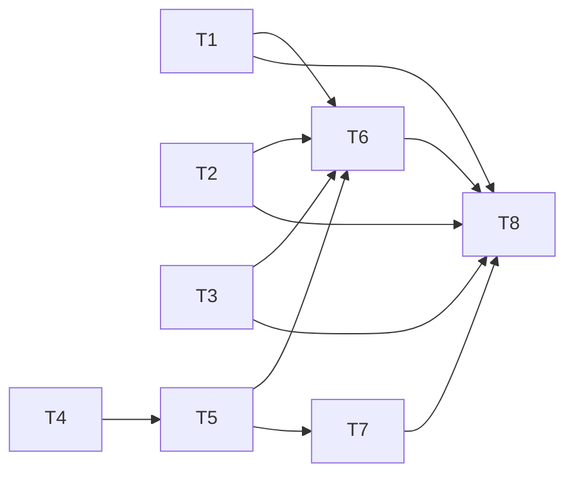

# pr-001-tasks.md — pr-001 内部任务列表（demand v1.0.0 减法重写 + 三文件对接同步）

**迭代**: 0031-demand-convergence-redesign ｜ **阶段**: 5（PR 实现）· planner（子 agent 内部步骤）
**PR 文件**: `docs/iterations/0031-demand-convergence-redesign/prs/pr-001-demand-v1-rewrite-and-sync.md`
**PR worktree 分支**: `feat/0031-pr-001-demand-v1-rewrite`（快照 HEAD = `04dab45`，工作树干净）
**任务总数**: 8（T1~T7 为产出任务，T8 为 dev 自检收口任务）｜ **依赖图**: 无环（见 §2）
**关键路径**: `T4 → T5 → T7 → T8`
**输入真源**: PR 文件（41 条验收标准 + 文件范围）；`architecture.md` §3.1~§3.7、§4、§5、§6、§7、§8、§9、§11；`prd/F01~F13`、`G01`
**性质**: 本 PR 内部任务列表，供 dev 消费；不是全局任务图

> 本 PR 零代码：全部交付物是 Markdown。判据均为 PR 文件里的 `grep` / `sed` / `git diff` 命令，在 PR worktree 根目录执行，`D=roles/demand/demand.md`。

---

## 0. 范围

### 0.1 可写文件（唯一白名单，= PR「文件范围」）

| # | 文件 | 动作 | 任务 |
|---|---|---|---|
| 1 | `roles/workflow-pb/workflow-pb.md` | 只改 :52 两列、:228 括号 | T1 |
| 2 | `.claude/skills/workflow-pb/SKILL.md` | 只改 :130 示例括号 | T2 |
| 3 | `roles/prd/prd.md` | 只改 §8 表九处 | T3 |
| 4 | `roles/demand/demand.md` | 整篇重写 v0.7.0 → v1.0.0 | T4、T5 |
| 5 | `roles/demand/data/demand-changelog.md` | 只在最上方新增 v1.0.0 条目 | T6 |
| 6 | `docs/iterations/0031-demand-convergence-redesign/demand-skill-checklist.md` | 新建 | T7 |

### 0.2 不做（防夹带）

- 不改迭代 `demand.md`（AC-41 以 8a64c92 为基线判零差异）、`architecture.md`、`prd.md`、`prd/**`、`status.md`、PR 文件本身。
- 不动 `roles/pb-v1-talk/**`（AC-40）、其它任何 `roles/*` / `.claude/*` 文件（AC-38/39）。
- workflow-pb、prd、SKILL.md 均不升版本、不写各自 changelog、不新建 `data/prd-changelog.md`（architecture §6 方案 A；§14 Q-A1 只提及不修）。
- workflow-pb :241、SKILL.md :166 / :342 / :349 的 `model_inferred` 条款不改（architecture §5 末段、§14 Q-A2）。
- 不新增 scripts/、references/、评估文件（architecture §13 边界冲突检查；F12 边界）。

### 0.3 验收标准编号（AC-01~AC-41，按 PR 文件出现顺序）

| AC | PR 行 | 摘要 | AC | PR 行 | 摘要 |
|---|---|---|---|---|---|
| 01 | :40 | CRITICAL 恰 3 + 格式 + 内容判据 | 22 | :74 | workflow-pb :52 新文 |
| 02 | :41 | Safety 对 C1/C2/C3 回看式验证 | 23 | :75 | workflow-pb :228 括号 |
| 03 | :42 | `名称顺序` | 24 | :76 | workflow-pb numstat `2 2`、版本不变 |
| 04 | :43 | 无 `维度列表|缺口大小` | 25 | :80 | prd 无旧术语 / 无 `"做什么"` |
| 05 | :44 | 无强制圈序 | 26 | :81 | prd `边界·做` ≥5、五项串 ≥1 |
| 06 | :45 | Align 展示收敛路径；Plan 重反射；`作废` ≥2 | 27 | :82 | prd `以 demand.md「衡量标准」为来源` |
| 07 | :46 | `让五项更明确` | 28 | :83 | prd `"执行方向"是方向，不是验收标准` |
| 08 | :47 | 三去向 + `不是按主题分好的类` + `取决于什么`；无 `一律…` | 29 | :84 | prd 只改九处，其余不变 |
| 09 | :48 | `可逆` + "不怕错、错了下一圈改" | 30 | :88 | checklist 21 行结论、无 `基本通过` |
| 10 | :49 | `为什么这题归你` ≥2；四段式只用于归用户的题 | 31 | :89 | #12 = D-16 保留项 + MI-12 附注 |
| 11 | :50 | 每圈摘要五要素；`未指出即` ≥2；Observation 回写 / 回 3 | 32 | :90 | 约束词按节计数表 + 原因栏 |
| 12 | :51 | 独立 Gate 节位置 + 四要素各 1 次 | 33 | :94 | 草稿 v0 由 AI 全写、每圈更新 |
| 13 | :52 | 不确认不交付；`头部状态行` ≥2；执行方向改 `user_confirmed` | 34 | :95 | `**版本**: 1.0.0` |
| 14 | :56 | 被删机制名零命中；Verify 无关键决策覆盖检查 | 35 | :96 | description 口径、无旧流程词 |
| 15 | :57 | 执行方向由 AI 推荐 | 36 | :97 | changelog v1.0.0 条目、只新增行 |
| 16 | :58 | `六维诊断`、四段式、`轮次上限`、identity 逐字不变 | 37 | :98 | SKILL.md :130、numstat `1 1`、主句不变 |
| 17 | :59 | 追问反射在 Work·Thought、不展示 | 38 | :102 | G01 两点 diff ⊆ 白名单 |
| 18 | :60 | §3.7 保留项六条可检索 | 39 | :103 | G01 未跟踪文件 ⊆ 白名单 |
| 19 | :71 | 交付物节位置、五项、三词表、回溯读法、无失败归因节 | 40 | :104 | 无 `pb-v1-talk` 改动 |
| 20 | :72 | 无 `大概怎么做|达到什么效果` | 41 | :105 | 迭代 demand.md 相对 8a64c92 零差异 |
| 21 | :73 | 原则·红线恰 2 条 | | | |

判据命令一律以 PR 文件原文为准，本文件只做分派与提醒，不改写判据。

---

## 1. 任务列表

### T1 · workflow-pb.md :52 / :228 逐字替换

- **文件**: `roles/workflow-pb/workflow-pb.md`
- **做什么**: 按 architecture §7 表逐字替换三处：:52「输出」列、:52「推进条件」列、:228 括号内容。:52「职责描述」列、:228 主句、:241、`**版本**: 0.14.1` 都不动。
- **覆盖 AC**: AC-22、AC-23、AC-24
- **完成判据**: AC-22/23/24 的命令原样跑通，其中 `git diff main --numstat -- roles/workflow-pb/workflow-pb.md` 为 `2	2	…`。
- **前置依赖**: 无 ｜ **优先级**: P0

### T2 · SKILL.md :130 示例括号替换

- **文件**: `.claude/skills/workflow-pb/SKILL.md`
- **做什么**: 按 architecture §7 表最后一行，把 :130 的 `（如 demand.md 两段均非空）` 换成 `（如 demand.md 五项齐全，且头部状态行记有用户对整份文档的明确确认）`。主句、版本行、description 不动。
- **覆盖 AC**: AC-37
- **完成判据**: AC-37 四条命令全部满足（`两段均非空` = 0；新串 = 1；numstat `1 1`；主句 `grep -cF` = 1）。
- **前置依赖**: 无 ｜ **优先级**: P0

### T3 · prd.md 九处术语替换

- **文件**: `roles/prd/prd.md`
- **做什么**: 按 architecture §8 表逐行替换 :13~14 / :20 / :46 / :47 / :60 / :70 / :87 / :91 / :106（§8 标题写"七处"，表内实为九处，以表和 PR 文件为准）。:128 / :133 小节标题、:136 / :146 / :163、CRITICAL、identity 其余句、报告契约、红线、`**版本**: 0.1.0` 不动。
- **覆盖 AC**: AC-25、AC-26、AC-27、AC-28、AC-29
- **完成判据**: AC-25~28 命令原样通过；`git diff main -U0 -- roles/prd/prd.md` 的每个 hunk 头都落在上述九处（:13~14 算一处）。
- **注意**: :87 / :91 是长行，只替换 §8 表列出的片段，句中其余内容保持原样。
- **前置依赖**: 无 ｜ **优先级**: P0

### T4 · demand.md v1.0.0（上半部）：frontmatter → 交付物结构与来源标记

- **文件**: `roles/demand/demand.md`
- **做什么**（architecture §11 渐进写法：先把 §3.1 全部节标题 + 每节首句落成骨架，再填本任务负责的节）:
  1. 全文骨架：§3.1 表 #0~#19 的节序，含 Workflow 下 1~6、`### Gate：终稿整份确认`、7、8。
  2. frontmatter：`description` 用 §3.4 原文；`identity` 与 v0.7.0 逐字相同；`relationship` 只改第 3 句（§3.4）；`character` 用 §3.4 推荐稿（L1-3=A）。
  3. 头部：`**版本**: 1.0.0`、日期、变更历史指针。
  4. 首部 CRITICAL ×3：§3.2 表 C1 / C2 / C3 原文，各自独立加粗成段，形如 `**CRITICAL: {规则}——{后果}**`。
  5. 一句话职责、成功标准 7 条（§3.5）。
  6. Strategy：首句"让五项更明确"（§3.6 核心哲学 2 句）；惯性表 ≤8 行（§3.6 列出的 4 保留 + 4 新增）；锚点 1 收敛路径（含"五项的列举顺序只是名称顺序，不是收敛顺序"）；锚点 2 问题准入；锚点 3 决策归属（三种去向 + "这几类依据是判断时的锚点，不是按主题分好的类……" + "正确答案取决于什么" + 可逆性第二把尺 + "不怕错、错了下一圈改"）；判断锚点（停止 / 切换）。
  7. `## 交付物结构与来源标记`（放在 `## Workflow` 之前）：两段结构；第二段恰为五项，依次需求 / 目标 / 边界 / 衡量标准 / 执行方向；"执行方向写到方向为止"；§5 三词表（只在这一节定义）+ 承载位置；失败归因回溯读法写在本节正文，不单设标题。
- **覆盖 AC**: AC-01、AC-03、AC-07、AC-08、AC-09、AC-19、AC-34、AC-35；AC-16 的 identity 部分；AC-10 的 C1 那一处
- **完成判据**: 上列 AC 命令在本任务完成时即可跑通（AC-01 的 `grep -c 'CRITICAL'` = 3 要求 Safety 等后续节也不出现 `CRITICAL` 字样，T5 须保持）；`git diff main -- $D` 的 identity 块无增删行。
- **约束词**: Strategy ≤1（"依赖先于被依赖"一句带原因）；交付物节 ≤1（第二段恰为五项）；一句话职责 / 成功标准 0（§3.1 预算列）。
- **不写**: 被删机制名（AC-14 列表）、`model_inferred`、`大概怎么做` / `达到什么效果`、强制圈序、任何正例样板（architecture §3.1 末段、§4 A-02）。
- **前置依赖**: 无 ｜ **优先级**: P0

### T5 · demand.md v1.0.0（下半部）：Workflow 1~8 + Gate → Safety

- **文件**: `roles/demand/demand.md`
- **做什么**:
  1. Workflow 1 上下文获取：沿用 v0.7.0。
  2. Workflow 2 目标对齐：复述核心问题 → AI 写五项实时草稿 v0（全部由 AI 执笔，不留空项）→ 收敛路径反射并向用户展示三要素（圈数 / 每圈框定哪一项 / 为什么这样排）。
  3. Workflow 3 计划：收敛路径即计划；上游被推翻 → 重反射，并标出作废的下游结论。
  4. Workflow 4 工作（T-A-O，§3.6）：Thought = 本圈项 → 缺口 → 准入 → 归属，追问反射在此作为内部思考、不展示，专家视角作为内部反射锚点、不展示；Action = AI 改写草稿并给推荐（含执行方向，由用户在每圈摘要或终稿 Gate 中修正）；只有归用户的题用四段式抛出，四段式前加归属行（补哪一项 + 为什么这题归你），"选项"一行并入决策形状（互斥 / 可叠加），可批量（通常 3~5 个）；AI 定 → 草稿 + 摘要标 `ai_decided`；拿不到的事实 → `open`；"都可以"：不重要 → `ai_decided`，没想清 → 给聚焦选项；Observation = 纠偏回写草稿，被指出的是上游结论就回「3. 计划」重反射；每圈收口摘要五要素（§4 表"每圈摘要"行，含"未指出即视为通过，这只适用于过程"）；上下文管理一句（§3.6）；退出条件写"不设轮次上限"；边界收敛规则（最小闭环）。
  5. Workflow 5 验证：结构检查 + 内部验收清单（源自六维诊断，五项：明确性 / 逻辑闭环 / 边界完整性 / 内部一致性 / 衡量标准可判断达到与否）；目标与方案脱节时直接给改写提案，写在逻辑闭环项里；不写针对"关键决策"的追问覆盖检查。
  6. Workflow 6 修复。
  7. `### Gate：终稿整份确认`：§3.3 原文四要素，`**触发条件**` `**验证内容**` `**通过标准**` `**未通过处理**` 各 1 次。
  8. Workflow 7 交付（不再有四段摘要）、8 反思沉淀。
  9. Tools and capability boundaries：按新流程改写做 / 不做。
  10. 原则：红线恰 2 条（来源标记如实，不把 `ai_decided` 冒充 `user_confirmed`；执行方向不下沉技术选型）、理解优先、简单优先（边界收敛）、验证优先、边界纪律。
  11. 决策记录：沿用。
  12. `## Safety`：§3.2 表三条尾部验证句，与 C1 / C2 / C3 一一对应（不用 `CRITICAL` 字样），外加来源如实、执行方向止于方向。
  13. 首尾校对：对照 §3.2 核对 CRITICAL ↔ Safety。
- **覆盖 AC**: AC-02、AC-06、AC-10、AC-11、AC-12、AC-13、AC-15、AC-16、AC-17、AC-18、AC-21、AC-33；另外全文反向检索 AC-04、AC-05、AC-14、AC-20 在本任务完成时终判
- **完成判据**: AC-01~AC-21、AC-33~AC-35 全部命令对完整 `$D` 原样通过；`grep -n '^### ' $D` 顺序为 `6. 修复` → `Gate：终稿整份确认` → `7. 交付`；`wc -l $D` 目标 ≤250（architecture §3.1 设计目标，不属于 PR 验收；超出时在 T8 报告里说明）。
- **约束词**: Workflow 整个 `##` 合计 ≤2，全部落在 Work（每圈必出摘要；四段式只用于归用户的题，均带原因）；其余 Workflow 小节、Gate、Tools、决策记录 0；红线 2；Safety ≤2（§3.1 预算列）。
- **前置依赖**: T4 ｜ **优先级**: P0

### T6 · demand-changelog v1.0.0 条目

- **文件**: `roles/demand/data/demand-changelog.md`
- **做什么**: 在 frontmatter 与标题之后、`## v0.7.0` 之前插入 `## v1.0.0（2026-09-28）` 条目，按 v0.7.0 条目体例写 `**需求**` `**变更原因**` `**决策过程**` `**经验总结**` 四要素；具体改动下单列「联动修改」小节，逐条列出 workflow-pb :52 / :228、SKILL.md :130、prd.md 九处（architecture §6 方案 A）；`**经验总结**` 里放一句指向 `docs/iterations/0031-demand-convergence-redesign/demand-skill-checklist.md` 的指针（architecture §9）。被删机制的历史只写在这里（architecture §3.1 末段）。既有条目一字不动。
- **覆盖 AC**: AC-36
- **完成判据**: `grep -n '^## v' … | head -1` 为 `## v1.0.0…`；四要素和「联动修改」可检索；`git diff main --numstat -- roles/demand/data/demand-changelog.md` 的删除列为 0。
- **前置依赖**: T1、T2、T3、T5（联动修改要按实际改动列，条目内容要与新版 demand.md 一致）｜ **优先级**: P1

### T7 · demand-skill-checklist.md（§12 核查记录）

- **文件**: `docs/iterations/0031-demand-convergence-redesign/demand-skill-checklist.md`（新建）
- **做什么**（格式按 architecture §9）:
  1. 核查表：列为 `# | 原则 | 结论 | 证据（新版 demand.md 节名或行号） | 理由`，#0、#0b、#1~#19 共 21 行。结论只取 通过 / 不适用 / D-16 保留项；不适用与 D-16 保留项必须写理由。以 §9 预判为起点，用 T5 完成后的实际文本逐项复核，不照抄预判。#12 = D-16 保留项；表后附注写明"编排元数据""流程层"两处涉及时不判红（MI-12）。
  2. 约束词按节计数表：CRITICAL 全文计数 + `##` 与 `###` 两级各节中加粗或独立成句的 必须 / 绝不 / MUST / NEVER 计数（MI-13 口径），每节 ≤2，并与 §3.1 预算列逐节对照；每处约束词另列"原因"栏，摘出它紧跟的原因（同句或下一句）。原因栏为空 → 判不通过，回 T4/T5 改 demand.md。
  3. 通读类证据：PR 文件要求"节名写进核查记录"的判据（AC-02、AC-06、AC-09、AC-10 四段式适用范围、AC-11 Observation、AC-13、AC-14 Verify 通读、AC-17、AC-18 各子项、AC-21、AC-33），逐条写上对应节名。
- **覆盖 AC**: AC-30、AC-31、AC-32；并承载 AC-09、AC-18 等通读判据的节名证据
- **完成判据**: AC-30 的 `grep -c '基本通过'` = 0，表内 21 行结论都在三值内；AC-31 附注存在；AC-32 计数表逐节 ≤2 且原因栏无空行。
- **前置依赖**: T5 ｜ **优先级**: P1

### T8 · 全量自检与 G01 范围守卫

- **文件**: 无新增写入（只读核查；发现问题回对应任务修）
- **做什么**: 按 architecture §11 阶段 5 自检顺序跑一遍：① F08 正向 / 反向检索；② 按节计数约束词，与 T7 的表对齐；③ CRITICAL ↔ Safety 一一对应；④ checklist；⑤ changelog。然后把 PR 文件 41 条判据命令逐条原样执行一遍，最后跑 G01 四条。
- **覆盖 AC**: AC-38、AC-39、AC-40、AC-41；并对 AC-01~AC-37 做终验
- **完成判据**: 41 条全部通过；AC-38/39 输出 ⊆ 五文件白名单；AC-40 = 0；AC-41 无输出。给出每条的命令 + 实际输出。
- **前置依赖**: T1~T7 ｜ **优先级**: P0

---

## 2. 依赖图与执行顺序

- 无环。T1 / T2 / T3 / T4 互相独立，可并行（architecture §11：四个文件没有真实的内容依赖，下游措辞已逐字给定）。
- 建议顺序：T1 → T2 → T3 → T4 → T5 → T7 → T6 → T8（先做三处小改动，变更面清楚后再写 demand.md；checklist 先于 changelog，这样经验总结的指针指向已存在的文件）。
- 关键路径：T4 → T5 → T7（或 T6）→ T8。

## 3. AC 覆盖校验

| 任务 | AC |
|---|---|
| T1 | 22、23、24 |
| T2 | 37 |
| T3 | 25、26、27、28、29 |
| T4 | 01、03、07、08、09、19、34、35（+16 identity、10 的 C1 处） |
| T5 | 02、04、05、06、10、11、12、13、14、15、16、17、18、20、21、33 |
| T6 | 36 |
| T7 | 30、31、32 |
| T8 | 38、39、40、41（+ 01~37 终验） |

AC-01~AC-41 各至少落在一个产出任务上，无遗漏；没有 PR 文件范围外的任务。
