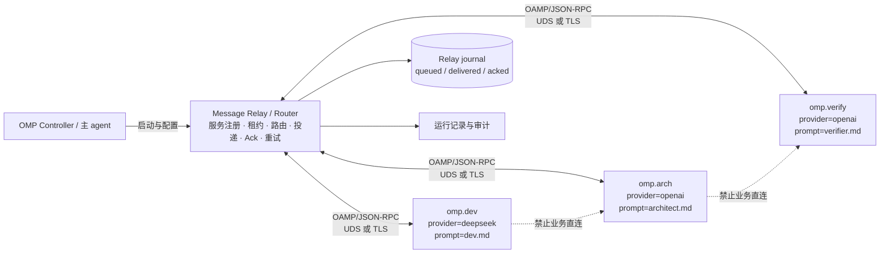

# 多 OMP 实例与 Agent 间通信协议方案

**状态**：方案建议，待实现阶段确认

**版本**：0.2.0

**日期**：2026-09-09

## 1. 结论摘要

建议把需求拆成两个协议层：

1. **实例启动与模型派发**：复用现有 `model-dispatch-protocol` / ACP 语义。每个 OMP 实例有独立的 `instance_id`，可以独立指定 `executor`、`provider`、`model` 和初始化规则。
2. **实例间消息通信**：新增 `OMP Agent Messaging Protocol`（简称 **OAMP**）。线协议采用 **JSON-RPC 2.0**，消息与任务语义对齐 **A2A**。所有实例必须先与消息中转建立长连接/租约，所有业务消息只能经中转转发；本机默认通过 **Unix Domain Socket** 接入 Router，跨机器时再启用 HTTP(S) 或 WebSocket 适配。

推荐的最小拓扑：

```text
                 ┌──────────────────────────┐
                 │ OMP Router / Supervisor  │
                 │ registry + route + relay │
                 └──────────┬───────────────┘
          UDS / JSON-RPC    │    UDS / JSON-RPC
        ┌────────────────────┼────────────────────┐
        │                    │                    │
  ┌─────▼─────┐        ┌─────▼─────┐        ┌─────▼─────┐
  │ omp.dev   │        │ omp.arch  │        │ omp.verify│
  │ deepseek  │        │ gpt       │        │ gpt       │
  │ init.md   │        │ init.md   │        │ init.md   │
  └───────────┘        └───────────┘        └───────────┘
```

Router 是强制中转层，负责服务链接、注册、路由、投递、Ack、心跳、重试和生命周期，不持有 provider API key，也不替代 OMP 内部的 LLM 会话管理。Agent 之间禁止建立业务直连；即使发送方和接收方在同一主机，也必须经过 Router。这样 Router 才能持续掌握在线状态、统一路由并恢复未完成投递。

### 1.1 强制中转架构



不可变规则：

1. Agent 启动后必须先调用 `agent.link`，取得 `link_id` 和租约，才能注册为可投递目标。
2. Agent 发送消息时只能调用自己连接上的 Router `message.send`，不能向另一个 Agent 的 socket/HTTP 地址发送业务消息。
3. Router 是唯一的服务发现和下一跳选择者；Agent 不维护其他 Agent 的连接地址。
4. 连接断开或租约过期后，Router 立即停止向该 session 投递；未 Ack 消息按投递策略进入重试/过期流程。
5. Router 重启必须从 relay journal 恢复 `queued` 和 `delivered-unacked` 状态，避免中转重启造成静默丢信。

消息路径固定为：

```text
发送 agent → agent.link 连接 → Router 接收 → 路由决策
  → Router 投递 → 接收 agent Ack → Router 更新投递状态
```

## 2. 需求映射与边界

| 用户需求 | 协议能力 | 关键约束 |
|---|---|---|
| 启动多个 OMP 实例 | `instances[]` 配置 + `agent_id` 注册 | 每个实例独立进程、会话、工作目录和 provider 目标 |
| 每个实例指定 DeepSeek、GPT 等 | `provider` / `model` 路由字段 | provider 凭据仍由 OMP/宿主管理，配置只引用 secret 名称 |
| 每个实例注入初始化提示词 | `prompt_profile` + `init_prompt` | 初始化提示词在实例启动时固定，不能被普通消息静默覆盖 |
| Agent 间消息投递 | `message.send` / `message.deliver` | 至少一次投递，使用 `message_id` 幂等去重 |
| 中转服务链接与保活 | `agent.link` + lease + `agent.heartbeat` | 链接租约控制是否可投递；心跳续租；Ack 仍只代表消息接收 |
| 任意路由通信 | Router 的 `to.agent_id`、`to.topic`、`reply_to`、`forward_path` | 支持点对点、广播和请求-响应；禁止无界广播 |

本方案不改变现有 role 文件语义，也不把 provider secret、登录态或 API key 放入 agents 配置。已有 `executor + model` 解析、fallback、`requested/selected` 审计继续有效；本方案新增的是**运行实例层**和**消息层**。

## 3. 标准协议选型

### 3.1 方案比较

| 方案 | 适合部分 | 不足 | 结论 |
|---|---|---|---|
| MCP | Agent 调用工具、读取资源、接入上下文 | 不是 agent-to-agent mailbox；没有本需求所需的任意 agent 路由模型 | 不作为主通信协议 |
| A2A | Agent Card、能力发现、Message/Task、流式更新、跨进程/跨网络协作 | Ack、心跳、投递队列和本地 supervisor 语义需要扩展 | 作为消息/任务语义参考与未来互操作层 |
| JSON-RPC 2.0 | 明确的 request/response/notification、错误码、易于在 UDS/HTTP 上承载 | 本身不定义 agent、任务、心跳和投递语义 | 作为 OAMP v1 线协议 |
| WebSocket | 双向长连接、适合实时事件 | 本地部署复杂度高；需要额外定义消息与重连语义 | 跨主机或浏览器场景再启用 |
| 自定义 TCP/消息队列 | 可高度定制 | 引入新的可靠性、版本、安全和运维协议 | 当前不推荐 |

### 3.2 推荐决策

采用 **JSON-RPC 2.0 + A2A 语义 + OAMP 扩展**：

- JSON-RPC 2.0 规定外层请求、响应、通知和错误结构。
- A2A 的 `AgentCard`、`Message`、`Task`、流式更新等概念用于保持未来互操作方向。
- OAMP 自己定义 `register`、`heartbeat`、`ack`、投递状态、幂等和路由扩展；不声称 OAMP v1 是完整 A2A 实现。
- 本地默认使用 UDS；同一 Router 负责所有实例的发现和消息转发。
- Router 是强制 relay，不允许 Agent 间业务直连；`agent.link` 是消息发送与接收的前置条件。

这比直接把 MCP 当消息总线更贴合需求，也比直接完整实现 A2A 更小、更容易测试。A2A 仍可作为后续跨组织/跨网络互操作的 northbound adapter。

## 4. 实例配置协议

建议路径：

```text
.pb-agents/config/omp-instances.yaml
.pb-agents/prompts/<instance-id>.md
.pb-agents/project/runtime/omp/<instance-id>/
```

示例：

```yaml
version: 1

router:
  transport: unix
  socket: .pb-agents/project/runtime/omp/router.sock
  relay_mode: mandatory
  journal: .pb-agents/project/runtime/omp/relay.ndjson
  heartbeat_interval_ms: 10000
  heartbeat_timeout_ms: 30000
  link_lease_ms: 30000
  ack_timeout_ms: 5000
  max_delivery_attempts: 3

instances:
  - instance_id: dev-deepseek
    executor: omp
    provider: deepseek
    model: deepseek-chat
    prompt_profile: .pb-agents/prompts/dev-deepseek.md
    role: dev
    working_directory: .
    labels: [implementation, backend]

  - instance_id: architect-gpt
    executor: omp
    provider: openai
    model: gpt-5
    prompt_profile: .pb-agents/prompts/architect-gpt.md
    role: architect
    working_directory: .
    labels: [architecture]

  - instance_id: verifier-gpt
    executor: omp
    provider: openai
    model: gpt-5
    prompt_profile: .pb-agents/prompts/verifier-gpt.md
    role: verifier
    working_directory: .
    labels: [verification]
```

字段规则：

- `instance_id` 是稳定的逻辑身份；重启后保持不变。每次进程运行另发 `session_id`。
- `executor` 默认继承现有路由协议，当前主要为 `omp`。
- `provider` 与 `model` 是实例的目标选择；`provider` 不等于 secret。实际认证由 OMP 或宿主环境完成。
- `prompt_profile` 指向只读初始化提示词文件。配置中允许 `prompt_inline` 仅用于测试，不建议生产使用。
- `role` 只声明能力角色，不覆盖现有 role 文件的职责定义。
- `working_directory` 必须解析为项目内允许的目录，不能通过消息动态修改。
- `labels` 供路由选择使用；路由不能把任意自然语言当成隐式目标。
- 不允许出现 `api_key`、`token`、`password`、`authorization` 等凭据字段；配置校验应快速失败。

### 4.1 初始化提示词层级

实例启动时按以下顺序形成 system/developer 初始化上下文：

```text
框架安全边界
  → role 文件定义
  → instance prompt_profile
  → 本次任务 brief
  → 普通 agent 消息
```

`prompt_profile` 的要求：

1. 只在实例创建/重启时加载，并计算 `prompt_hash`。
2. 运行期间普通消息不能替换或删除它；如需变更，必须执行 `agent.reload_prompt`，生成新的 `session_id` 并记录变更原因。
3. Agent 回报中包含 `instance_id`、`session_id`、`prompt_hash`，便于确认消息究竟由哪套规则执行。
4. 初始化提示词不自动继承主 agent 会话；主 agent 只能通过明确的消息或 brief 传递任务上下文。

## 5. Agent 服务链接、身份、注册和发现

### 5.1 服务链接是投递前置条件

每个实例启动后先与 Router 建立一条长连接。连接可以是 UDS stream，也可以是跨主机的 TLS stream；协议内容都使用 OAMP/JSON-RPC。Router 为连接分配 `link_id`、`lease_id` 和租约截止时间。

```text
starting
  → agent.link
  → link established
  → agent.register
  → registered / eligible-for-delivery
```

`agent.link` 示例：

```json
{
  "jsonrpc": "2.0",
  "id": "link-001",
  "method": "agent.link",
  "params": {
    "protocol": "oamp",
    "protocol_version": 1,
    "agent_id": "dev-deepseek",
    "session_id": "sess-01J...",
    "transport": "unix",
    "requested_lease_ms": 30000,
    "capabilities": ["message", "task", "stream", "heartbeat"]
  }
}
```

Router 返回：

```json
{
  "jsonrpc": "2.0",
  "id": "link-001",
  "result": {
    "linked": true,
    "link_id": "link-01J...",
    "lease_id": "lease-01J...",
    "lease_ms": 30000,
    "heartbeat_interval_ms": 10000,
    "relay_mode": "mandatory"
  }
}
```

只有携带有效 `link_id` 的连接才能调用 `agent.register`、`message.send` 和接收 `message.deliver`。Router 不接受没有服务链接的“离线发送方”，除非后续明确增加持久化发送端身份机制。

### 5.2 注册 Agent

完成服务链接后，实例再向 Router 发送注册请求：

```json
{
  "jsonrpc": "2.0",
  "id": "req-001",
  "method": "agent.register",
  "params": {
    "agent": {
      "agent_id": "dev-deepseek",
      "session_id": "sess-01J...",
      "name": "dev-deepseek",
      "role": "dev",
      "executor": "omp",
      "provider": "deepseek",
      "model": "deepseek-chat",
      "prompt_hash": "sha256:...",
      "labels": ["implementation", "backend"],
      "capabilities": ["message", "task", "stream"]
    },
    "link_id": "link-01J...",
    "lease_id": "lease-01J..."
  }
}
```

Router 返回：

```json
{
  "jsonrpc": "2.0",
  "id": "req-001",
  "result": {
    "registered": true,
    "agent_id": "dev-deepseek",
    "session_id": "sess-01J...",
    "link_id": "link-01J...",
    "lease_id": "lease-01J...",
    "router_protocol": "oamp/1"
  }
}
```

`agent_id` 与 `session_id` 必须分离：消息目标使用稳定的 `agent_id`；Router 使用 `session_id` 判断当前连接，旧进程不能继续接收新消息。`link_id` 表示本次连接，`lease_id` 表示 Router 授予的可投递租约，三者都不能由 Agent 自行伪造。

### 5.3 链接保活与断线

心跳不是单独的“在线广播”，而是服务链接的租约续期操作：

```json
{
  "jsonrpc": "2.0",
  "id": "hb-100",
  "method": "agent.heartbeat",
  "params": {
    "link_id": "link-01J...",
    "lease_id": "lease-01J...",
    "agent_id": "dev-deepseek",
    "session_id": "sess-b",
    "state": "busy",
    "inflight": ["msg-01J..."],
    "sent_at": "2026-09-09T12:00:10Z"
  }
}
```

Router 对有效心跳返回新的租约截止时间：

```json
{
  "jsonrpc": "2.0",
  "id": "hb-100",
  "result": {
    "alive": true,
    "link_id": "link-01J...",
    "lease_expires_at": "2026-09-09T12:00:40Z"
  }
}
```

状态约束：

- `heartbeat_interval_ms` 必须小于 `link_lease_ms`，推荐为租约的 1/3。
- 连续两个心跳周期未收到有效心跳，Router 将连接标记为 `suspect`，停止新消息投递但保留恢复窗口。
- 租约过期后标记为 `offline`，立即关闭该 link 的投递资格；未 Ack 消息进入重试或过期状态。
- Agent 重连必须生成新的 `link_id` 和 `session_id`，但可以复用稳定的 `agent_id`。
- 旧 link 的迟到 Ack 必须被拒绝或标记为 stale，不能确认新 link 上的投递。

## 6. 消息模型

### 6.1 统一消息封套

```json
{
  "message_id": "msg-01J...",
  "conversation_id": "conv-01J...",
  "correlation_id": "req-01J...",
  "type": "task.request",
  "from": {"agent_id": "architect-gpt", "session_id": "sess-a"},
  "to": {"agent_id": "dev-deepseek"},
  "reply_to": "architect-gpt",
  "created_at": "2026-09-09T12:00:00Z",
  "expires_at": "2026-09-09T12:10:00Z",
  "delivery": {
    "mode": "at_least_once",
    "ack_required": true,
    "ack_deadline_ms": 5000,
    "max_attempts": 3
  },
  "payload": {
    "content_type": "text/markdown",
    "body": "请实现 brief 中的后端变更。"
  },
  "trace": {"trace_id": "trace-01J...", "forward_path": []}
}
```

消息类型最小集合：

| 类型 | 用途 | 是否要求处理结果 |
|---|---|---:|
| `task.request` | 请求另一个 agent 执行任务 | 是 |
| `task.update` | 任务进度、阶段或阻塞更新 | 否 |
| `task.result` | 返回任务结果 | 否 |
| `event.notice` | 普通通知或事实广播 | 否 |
| `control.cancel` | 请求取消一个任务 | 是，返回取消结果 |
| `control.reload_prompt` | 请求重新加载初始化规则 | 是，必须生成新 session |

### 6.2 投递方法

发送方调用 Router：

```json
{
  "jsonrpc": "2.0",
  "id": "rpc-100",
  "method": "message.send",
  "params": {"link_id": "link-01J...", "lease_id": "lease-01J...", "message": {"message_id": "msg-01J...", "to": {"agent_id": "dev-deepseek"}, "type": "task.request", "payload": {"content_type": "text/plain", "body": "..."}, "delivery": {"ack_required": true, "max_attempts": 3}}}
}
```

Router 的同步响应只表示“已接受并进入投递流程”，不表示目标 agent 已经处理：

```json
{
  "jsonrpc": "2.0",
  "id": "rpc-100",
  "result": {"accepted": true, "message_id": "msg-01J...", "status": "queued"}
}
```

Router 投递给目标 agent：

```json
{
  "jsonrpc": "2.0",
  "method": "message.deliver",
  "params": {"message": {"message_id": "msg-01J...", "type": "task.request", "from": {"agent_id": "architect-gpt"}, "to": {"agent_id": "dev-deepseek"}, "payload": {"content_type": "text/plain", "body": "..."}}}
}
```

目标 agent 必须尽快返回 Ack：

```json
{
  "jsonrpc": "2.0",
  "id": "ack-100",
  "method": "message.ack",
  "params": {
    "message_id": "msg-01J...",
    "agent_id": "dev-deepseek",
    "session_id": "sess-b",
    "link_id": "link-01J...",
    "status": "accepted",
    "received_at": "2026-09-09T12:00:01Z"
  }
}
```

Ack 状态：

- `accepted`：已进入目标 agent 的持久化 inbox 或内存执行队列。
- `started`：已开始处理，可作为可选的第二阶段确认。
- `completed`：业务处理完成；建议使用 `task.result` 而不是把大结果塞进 Ack。
- `rejected`：目标存在但拒绝处理，必须给出错误码。
- `expired`：超过消息 `expires_at`，不再处理。

### 6.3 Ack、心跳和重试的严格区分

| 机制 | 证明什么 | 不证明什么 |
|---|---|---|
| `message.ack` | 某个 session 收到并接受某条消息 | 任务完成、LLM 仍可用 |
| `agent.heartbeat` | 某个 session 在租约内仍在线 | 消息已收到、任务有进展 |
| `task.update` | 任务主动报告了状态 | 进程仍在线（应由心跳保证） |

心跳续租的具体请求见 §5.3。Router 在连续两个心跳周期未收到心跳时把 link 标为 `suspect`；超过 `heartbeat_timeout_ms` 或 lease 到期后标为 `offline`，对未 Ack 消息执行有限重试。重试不能改变 `message_id`，接收端必须按 `message_id` 幂等。

推荐语义是 **at-least-once delivery**，而不是伪造 exactly-once：

```text
发送 → queued → delivered → acked
                    │
                    └─ ack 超时 → retry（相同 message_id）
```

## 7. 任意路由规则

### 7.1 目标表达

支持三种目标：

```json
{"agent_id": "dev-deepseek"}
{"topic": "verification"}
{"selector": {"role": "verifier", "labels": ["backend"]}}
```

规则：

1. `agent_id` 点对点优先，Router 必须保证不会扩展成广播。
2. `topic` 和 `selector` 是显式广播；每个实际接收者生成独立投递状态，但共享原始 `message_id` 的逻辑父标识。
3. 不支持通过消息正文指定下一跳；转发必须显式使用 `forward_to`，且 Router 追加 `forward_path`。
4. `max_hops` 默认 8，`forward_path` 出现重复 agent 时拒绝，防止环路。
5. 只允许白名单 agent/label 路由；生产环境不允许任意 agent 发现或向所有 agent 广播。
6. 请求-响应使用 `correlation_id` 和 `reply_to`，不得依赖“最近一条消息”匹配。

### 7.2 Router 是否单点

MVP 允许 Router 是单进程单实例，因为它是本机强制中转服务，不是业务数据库。为避免它成为不可恢复的黑盒：

- inbox/outbox 使用 append-only NDJSON 或 SQLite 二选一；MVP 推荐 NDJSON，已有项目记录体系可直接审计。
- Router 重启后从 `queued` / `delivered-unacked` 恢复有限重试。
- Router 恢复期间不接受旧 `link_id` 的业务发送；Agent 必须重新建立服务链接并重新注册。
- 不在 Router 中保存完整 prompt、LLM 输出或 provider secret。
- 后续需要跨机器高可用时，再把 Router 替换为 A2A/HTTP gateway 或消息队列适配器，不改变消息 envelope。

## 8. 生命周期与异常语义

实例与服务链接状态：

```text
starting → linking → linked → registered → idle ⇄ busy
                                      │          │
                                      │          ├─ draining → stopped
                                      │          └─ suspect → offline
                                      └─ link expired → offline
```

关键错误码：

| 错误码 | 语义 | 发送方处理 |
|---|---|---|
| `AGENT_NOT_FOUND` | 目标 agent_id 不存在 | 不重试，除非先重新发现 |
| `AGENT_OFFLINE` | 目标已离线 | 按消息策略排队或过期 |
| `LINK_REQUIRED` | 发送方没有有效服务链接或租约 | 先 `agent.link`，不接受业务消息 |
| `STALE_LINK` | 使用了旧 link/session 的请求或 Ack | 丢弃并要求重新连接 |
| `DUPLICATE_MESSAGE` | 同一 message_id 已处理 | 返回已有状态，不重复执行 |
| `ROUTE_DENIED` | 路由不在白名单 | 失败并记录审计 |
| `MESSAGE_EXPIRED` | 已过期 | 不投递 |
| `ACK_TIMEOUT` | 目标未按时 Ack | 有限重试，超过上限转 failed |
| `PROTOCOL_MISMATCH` | 版本或能力不兼容 | 不重试，记录协商结果 |
| `PROVIDER_UNAVAILABLE` | OMP 的 provider 不可用 | 不由 Router 换 provider；交给现有 fallback/主 agent 决策 |

消息投递失败与 LLM 执行失败必须分开记录：前者是 Router/通信问题，后者是目标 agent 已收到后执行的问题。

## 9. 安全与权限边界

- UDS 文件权限默认 `0600`，只允许当前用户或项目运行用户访问。
- 每个 agent 注册时由 Router 通过本地启动 token 或父进程凭证确认身份；不能只信注册包中的 `agent_id`。
- 跨主机传输必须使用 TLS，并在连接层加入 agent 身份认证；不要把 API key 当作 agent 身份。
- Router 做消息大小、TTL、最大跳数、广播 fan-out 和单 agent 队列长度限制。
- prompt、消息正文、任务结果都视为不可信输入；Agent 初始化规则不能被 `control.reload_prompt` 以外的消息覆盖。
- 日志记录 `message_id`、from/to、状态、attempt、错误码、trace_id；默认不记录完整 prompt、token 和 LLM 输出。
- provider、endpoint、API key、登录态仍由 OMP/宿主负责，严格复用现有 `model-dispatch-protocol` 的凭据边界。

## 10. 与现有 ACP / 模型派发的关系

当前已有协议表达一次派发：

```text
requested executor/model → fallback → selected executor/model → ACP 启动 → completed/failed/blocked
```

本方案增加实例与消息后，建议的启动顺序是：

```text
读取 omp-instances.yaml
  → 逐实例解析 executor/provider/model
  → 由 OMP/宿主执行 provider 能力检查与 fallback
  → 启动实例并注入 prompt_profile
  → 注册到 Router
  → 接收 message.deliver
```

消息层不允许：

- 通过消息临时替换目标 provider；
- 让一个 agent 静默修改另一个 agent 的初始化提示词；
- 因投递失败自动切换 provider；
- 把 Router 变成 provider 凭据代理。

若主 agent 要让某个实例换模型，应发起显式的实例重启/重新派发操作，由现有 ACP 和 fallback 规则产生新的 `selected` 审计结果。

## 11. MVP 范围与验收矩阵

### MVP 必须包含

1. 一个 Router 进程和多个 OMP 子进程。
2. 每实例独立的 `instance_id`、provider、model、role、工作目录、初始化提示词。
3. UDS + JSON-RPC 2.0，以及强制 `agent.link` 服务链接。
4. `agent.link`、`agent.register`、`agent.heartbeat`、`message.send`、`message.deliver`、`message.ack`。
5. 所有消息必须经 Router；Agent 之间不能业务直连。
6. 点对点路由、`reply_to`、`correlation_id`、有限重试和幂等去重。
7. queued / delivered / acked / expired / failed 投递记录。
8. provider secret 不进入配置、消息、日志和 Router。

### 暂不纳入

- 多 Router 共识或跨地域高可用；
- 完整 A2A 远程互操作认证；
- Kafka/NATS 等外部消息队列；
- 自动根据 LLM 结果动态改路由；
- 跨项目广播；
- 将所有 agent 对话持久化为长期记忆。

### 验收矩阵

| 场景 | 期望结果 |
|---|---|
| 启动 3 个不同 provider/model 实例 | 三个独立 `agent_id` 注册成功，`selected` 目标各自可审计 |
| 每个实例使用不同 prompt_profile | `prompt_hash` 不同，普通消息不能替换初始化规则 |
| A → B 点对点消息 | B 收到一次或多次重试，但业务按 `message_id` 只执行一次 |
| B 处理慢但持续心跳 | Router 不把 B 标成 offline；Ack 仍按消息 deadline 处理 |
| B 进程宕机 | 心跳超时，未 Ack 消息有限重试或过期，不能无限重发 |
| 目标不存在 | 返回 `AGENT_NOT_FOUND`，不产生隐式广播 |
| A → selector 广播 | 每个接收者有独立投递状态，fan-out 受限 |
| 消息正文要求换 provider | 被视为普通内容，不改变实例目标 |
| provider 不可用 | 由现有能力报告/fallback 处理；Router 不接触 secret、不静默换 provider |
| Router 重启 | 已持久化的未完成投递可恢复；重复投递由幂等键吸收 |

## 12. 实施顺序建议

1. 先实现纯内存 Router + UDS JSON-RPC，固定 envelope 和状态机。
2. 加入 `agent.register` / heartbeat / Ack，并用两个假的 agent 做通信契约测试。
3. 接入 OMP 实例启动器，只注入配置和 prompt，不在 Router 中实现 provider 逻辑。
4. 增加 append-only 运行记录与重启恢复。
5. 再加入 selector/topic 路由、广播上限和权限白名单。
6. 最后视跨机器需求增加 HTTP(S)/A2A adapter；不要在 MVP 同时引入 WebSocket、消息队列和数据库。

## 13. 参考资料与调研结论

- [First Tree repository](https://github.com/agent-team-foundation/first-tree)：参考其“Context Tree + CLI/daemon + agent runtime + workspace”分层。对本需求最有价值的是把本机 daemon/runtime 作为连接层，而不是让每个 agent 自己维护一套连接管理。
- [A2A Protocol Specification](https://a2a-protocol.org/latest/specification/)：参考 Agent Card、Message/Task、流式事件和远程 agent 互操作语义。
- [JSON-RPC 2.0 Specification](https://www.jsonrpc.org/specification)：作为请求、响应、通知和错误的标准外层格式。
- [Model Context Protocol Specification](https://modelcontextprotocol.io/specification/2025-06-18)：适合作为工具和上下文接入协议；不承担本方案的 agent mailbox、Ack 和任意路由职责。
- [OpenTelemetry Trace Context](https://www.w3.org/TR/trace-context/)：`trace_id` / `correlation_id` 的后续可观测性方向。

## 14. 未决事项

以下事项不阻塞本协议方案，但进入实现前必须确认：

1. `omp` 的真实 CLI 是否支持独立 provider/model 参数、工作目录和 system prompt 文件；若不支持，需要在 ACP adapter 层适配，而不是修改 OAMP。
2. OMP 实例是否允许同一工作目录并发写入；若不允许，实例配置必须补充 worktree/文件锁策略。
3. 是否需要跨机器通信。若答案是否定的，MVP 只实现 UDS；若是肯定的，再确定 TLS 身份和远程 Agent Card。
4. 运行记录继续使用现有 `.pb-agents/project/` 文件体系，还是在业务项目中引入 SQLite。推荐先使用 append-only NDJSON，避免过早引入数据库。
