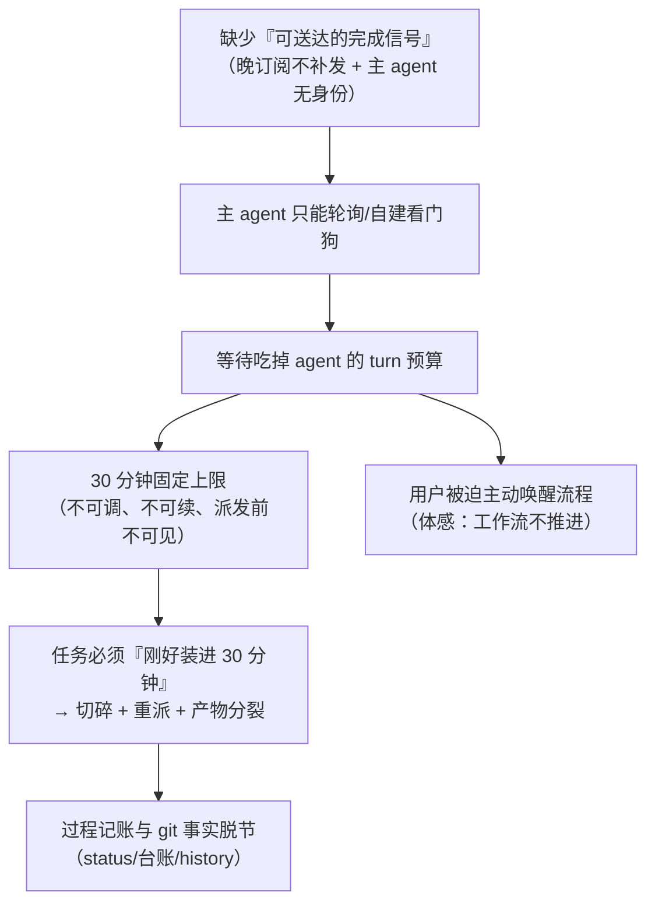

# 复盘：0029 —— 重点：hub 调用面与主 agent 待机（体感问题的机制级根因）

- 复盘对象：迭代 `0029-hub-client-session-and-duplex` 全过程的 hub 使用体感
- 证据来源：`docs/iterations/0029-hub-client-session-and-duplex/deferred-demand-changes.md`（DC-01~DC-39 搭置记录）、`clarifications/verify-20260917-101326-iteration-final.md`（阶段 6 终验）、`roles/retrospective/data/retro-2026-09-16-0028-hub-communication.md`（上一轮同域复盘）
- 作者：主 agent（本迭代执行者，体感问题的一手当事人）；正式复盘可另行派发 `retrospective` 角色
- 结论口径：**用户的两条体感不是两个问题，是同一根因的两面**

## 一、用户提出的问题（原话）

1. **"agent 有 30 分钟硬直，造成工作超时无法继续。"**
2. **"hub 回调有问题，主 agent 连接 hub 进行工作流仍然会待机，无法持续推进工作。"**

## 二、问题 1：30 分钟硬直 —— 机制级根因（五条，逐条附证据/代码位置）

| # | 机制 | 证据 |
|---|---|---|
| 1.1 | **上限固定**：omp 任务默认 `timeoutMs = 1800000`，不可由调用方调整 | `oamp/src/acp-client.js:319`（shell 任务另一档 `DEFAULT_TASK_TIMEOUT_MS = 30000`，`oamp/src/agent.js:30`）——DC-07 实测核实 |
| 1.2 | **调用面不暴露该参数**：`/api/calls` 参数表 = `chat_id / agent / task / tasks / context / output_schema / schema_mode / mode / model`，**没有 `timeout`** ⇒ 长任务无法申请更长时间 | DC-07 逐项核实 |
| 1.3 | **上限与"产物完成"解耦**：一次 calling 的 turn 含实现 **+ 汇报/自查/证据整理**；产物落盘 ≠ 调用结束 ⇒ 上限常被"报告阶段"吃掉 | prd：14:23 产物落盘 → 14:47:44 `failed/error=timeout`（`duration_ms=1802670`）⇒ **24 min 空耗**；pr-planner：15:18:41 产物落盘 → 15:22 撞上限 ⇒ **26 min 空耗**（DC-08 / 首次记录见 DC-01） |
| 1.4 | **无续接/续做面**：撞上限后没有"从断点继续"的入口，唯一缓解是**重派 + 任务切小** | DC-13 转入阶段 4 切分约束；DC-22/DC-26 的 pr-005 三轮 |
| 1.5 | **上限在派发前不可见**：调用方事前不知道剩余额度，也无法查"离上限还有多久" | DC-15/DC-25 的并发与超时面事实均靠事后实测 |

**代价（一手计数）**：本迭代因该上限造成 **5 例空耗/零交付**，空耗合计 **70 分钟**（DC-01 prd 24 min、DC-08+DC-13 architect/pr-planner 46 min），另 pr-005 dev 三轮中两轮零提交（DC-26）、pr-005 planner 7.2 min 即 `completed` 但产物缺失（DC-22）。
**制度性后果**：用户 2026-09-16 裁决 **D-19**——"先取消 hub 调用，直接本地 subagents 实现功能"；即**该上限直接导致 hub 作为唯一通道不可持续**（DC-27）。

## 三、问题 2：主 agent 待机 —— 机制级根因（四条）

| # | 机制 | 证据 |
|---|---|---|
| 2.1 | **主 agent 没有身份**：CLI 不注册为 Router 实例 ⇒ 消息面**结构性收不到推送**（0028 已侦察确认，本迭代未变） | `retro-2026-09-16-0028-…` §3.1；本迭代 DC-20 的自建清单 |
| 2.2 | **结果面默认是"拉"**：`call_result` 投递进 **chat 流**，需要**当时在线**的订阅者；**晚订阅不补发**（F04 出本期） | DC-17；F-8（`skill/hub.md` 序列 1 只教"派发 → `calls get`"） |
| 2.3 | **等待没有原语**：`--mode block` 会阻塞主 agent 自身的 turn；不 block 就只剩轮询 ⇒ **主 agent 被结构性逼向轮询** | DC-08a（`nohup … &` 裸等待）→ DC-13（`sleep` 定时器）→ 用户当场指出"你又自己实现连接层"（DC-20） |
| 2.4 | **文档主推路径不教事件驱动**（治根项，**本迭代已修**） | F-8 ⇒ **F19**：`skill/hub.md` 序列 1 改为 派发 → 等待 → 取件，并明写"轮询是兜底" |

**代价**：主 agent 自建 **5 件**连接/等待层（全部在 `/tmp`，仓库零污染），且**同一毛病第三次发生**（0028 复盘已明令禁止把自建 watchdog 当默认等待解）；本会话最初仍以 `sleep 600`/`nohup` 驱动流程，直到用户指出才改推送式（DC-20）。

## 四、两条体感是同一根因的两面（核心结论）

**一句话**：**"完成"这件事既不可送达（问题 2），也不与调用生命周期对齐（问题 1）** —— 于是"推进工作流"的责任被推回给人。

## 五、其余核心问题（按严重度，均一手可核）

| # | 问题 | 证据 | 本迭代是否已修 |
|---|---|---|---|
| 5.1 | **同角色实例串行执行** ⇒ "并发 3"是**槽位并发**，真实吞吐受单实例制约 | DC-15（三条 `planner` 同轮创建、实例侧串行） | 未修（属既有事实，调度不依赖并行度） |
| 5.2 | **终态不可信（两面）**：`completed` 不代表交付完成；`failed` 也不代表没有产物 | DC-22（`completed` 但 `prs/pr-005-…-tasks.md` 不存在、worktree 零提交）；DC-21/DC-26（`context_crashed` 立即失败 ×2）；DC-23（`completed` 但 `duration_ms/text` 均 null、零改动） | 未修（设计上以 **D-14「产物为权威」** 规避） |
| 5.3 | **无取消面** ⇒ 只能杀实例进程，副作用是终态被改写为 `context_crashed` | DC-27（实测 `hub api --help` 无 cancel/kill/stop）→ DC-28（对 `pb-dev` 发 SIGTERM） | **已交付** `POST /api/calls/:id/cancel`（F11） |
| 5.4 | **"产物已落盘"不是可观测事实** ⇒ 最强的等待信号缺失，逼出私有 watcher | DC-02/DC-04/DC-08；DC-20 第 1 项 `artifact-watch-0029.py` | **部分**：已交付 `GET /api/calls/wait` + 过滤订阅（F03/F09），但消费方仍须自建循环 |
| 5.5 | **停滞不可判别**：`working` 与卡死同形；`transcript` 1000 条截断且返回**前缀**（看不到尾部） | DC-02/DC-12/DC-16 | **部分**：已交付 `last_event_at`/`connected`/`since` 投影（F09/F16）；tail/游标未做 |
| 5.6 | **队列与占用不可见**：`queued` 恒 0、占用只有布尔 `busy` | DC-35（`queued` 语义）；DC-15 | 未修（`queued` 已登记为下迭代候选） |
| 5.7 | **隔离与取证的结构性冲突**：工作区名使 UDS socket 路径超 104B；模糊 `pgrep` 会误杀主集群 | DC-36（必须用短路径 socket）；DC-31（误杀 `pb-dev`，同轮发现并恢复） | 未修（已形成硬约束建议） |
| 5.8 | **记账与事实脱节**：PR 子状态 / 派发台账 / history 与 merge commit 三条线各自演化 | 阶段 6 终验**三轮**抓出（漏改 pr-007 行 → 口径 7 与台账 19 行/28 call id 对不上 → 脚注与一格矛盾） | 未修（终验者建议加"三向自动比对"） |
| 5.9 | **证据形态/口径反复返工**：验收证据格式、口径需多轮叮嘱才稳定 | DC-19（pr-001/002 返工）、DC-37（pr-006/007 同型） | 未修（治根：模板化 + tasks 冻结，见下） |

## 六、修复建议（按性价比排序）

1. **把"产物完成"升为一等事件**（治 2.2 + 5.4）：`artifact_ready` 类事件，**幂等 + 可对晚订阅者补发**（即本迭代出范围的 **F04** 的语义）；这是"像 subagent 一样"的最低门槛。
2. **调用生命周期与 turn 上限解耦**（治 1.1~1.5）：① `/api/calls` 暴露 `timeout`；② 或改为"心跳 + 可续做"，撞上限不判死而是留下可续状态；③ 至少把**剩余额度**暴露给调用方与派发方。
3. **主 agent 成为一等参与者**（治 2.1 + 2.3）：CLI 注册身份（本迭代 D-1/D-3/D-14 的身份面已具备）+ 一个"事件驱动的工作循环"参考实现，取代轮询与自建看门狗。
4. **验收证据格式由 `tasks` 冻结**，而非在主 agent 简报里反复叮嘱（治 5.9；本迭代已对 pr-003 起的内嵌模板生效，未根除）。
5. **阶段推进核查加一条三向机械比对**：PR 子状态表 ↔ merge commit ↔ 派发台账（治 5.8；本轮三项均由独立验证者抓出，说明"自证不可靠"）。
6. **单实例串行显式化**（治 5.1/5.6）：文档与投影明写"实例侧串行"，并给队列位置与占用者。

## 七、做得好的地方（避免复盘只列失败）

- **独立验证真的能抓出主 agent 自己的错**：阶段 6 三轮复核全部命中主 agent 的记账问题，且每次都给出**可复算的命令与算术**；终验者还主动声明"不擅自扩大或缩小标准"，把口径选择权交回。
- **搭置记录（deferred-demand-changes）机制有效**：39 条摩擦/错误/期望偏差在**不回退、不暂停**的前提下全部落盘，成为本复盘的一手证据源。
- **D-13 目标基本达成**：阶段 5 起结果自动到手，结束了"靠用户主动唤醒"（阶段 2~4 的 3 次空耗在阶段 5 未再出现）。
